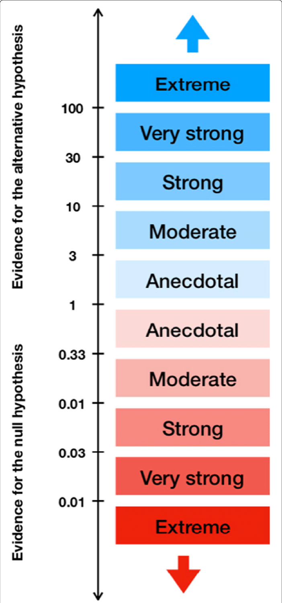

```{r setup, include=FALSE}
library(citr)
library(tidyverse)
library(magrittr)
library(lme4)
library(brms)
library(ggthemes)
library(kableExtra)
library(knitr)
library(readxl)
library(extrafont)
library(broom)
library(tidybayes)
library(janitor)
library(patchwork)
library(mixtools)
source("../scripts/functions.R")
options("kableExtra.html.bsTable" = T)
knitr::opts_chunk$set(echo = FALSE,
                      comment=NA, 
                      warning = FALSE,
                      message =FALSE)
theme_set(theme_few(base_size = 13))
```


# The notorious Bayes Factor | chapter 7.6 in @lee2014bayesian


## Bayes Factor

<div style="float: left;width: 70%;">

>- *p*-values have two possible outcomes: 
>1. reject the null (i.e. $p<0.05$)
>2. inconclusive (i.e. $p>0.05$ -- go back to start)

>- BFs have a continuum of three possible outcomes [@dienes2014using; @dienes2016bayes; @dienes2018four]:
>1. Reject the null / alternative hypothesis
>2. Inconclusive (get more data!)
>3. Accept the null / alternative hypothesis


</div>


<div style="float: right;width: 20%;">
{width="105%"}
</div>


## Bayes Factor 


<div style="float: left; width: 25%;">

$$
\text{BF} = \frac{p(H_1 \mid y)}{p(H_0 \mid y)} 
$$
</div>


<div style="float: right;width: 75%;">

>- How much more probable is one model (hypothesis) over the other?
>- How convinced should we be about the evidence for our hypothesis $H_1$ as opposed to, say, a null hypothesis $H_0$?
>- Savage-Dickey density ratio [@jeffreys1961theory; @dickey1970weighted]:
>- Height of the posterior density at zero compared to the height of the prior density at zero.
</div>


## Bayes Factor: Savage-Dickey density ratio

<div style="float: left;width: 25%;">

$$
\text{BF} = \frac{\text{prior}}{\text{posterior}}
$$


>- Posterior: $N(2.5, 1)$
>- Prior: $N(0,10)$


</div>

<div style="float: right;width: 60%;">


```{r fig.width=5}
pd <- tibble(x = seq(-5, 5, by = .1),
             Prior = dnorm(x, 0, 10),
             Posterior = dnorm(x, 2.5, 1)) %>%
  pivot_longer(Prior:Posterior)

data_at_zero <- filter(pd, x == 0)
pr <- filter(data_at_zero, name == "Prior") %>% pull(value)
po <- filter(data_at_zero, name == "Posterior") %>% pull(value)

ggplot(pd, aes(x = x, y = value, colour = name)) +
  geom_line() +
  geom_point(data = data_at_zero, aes(x = x, y = value), 
             colour = "black", size = 2) +
  geom_label(data = data_at_zero, aes(x = x, y = value + .02, label = round(value, 3)), 
             colour = "black", size = 3) +
  scale_color_colorblind("") +
  labs(y = "density", x = bquote(hat(beta)), subtitle = bquote("BF"==.(round(pr/po,2)))) +
  theme(legend.position = c(0.25,.9),
        legend.direction = "horizontal")
```
</div>


## Bayes Factor: Savage-Dickey density ratio

<div style="float: left;width: 25%;">

$$
\text{BF} = \frac{\text{prior}}{\text{posterior}}
$$


>- Posterior: $N(2.5, 1)$
>- Prior: $N(0,5)$


</div>

<div style="float: right;width: 60%;">


```{r fig.width=5}
pd <- tibble(x = seq(-5, 5, by = .1),
             Prior = dnorm(x, 0, 5),
             Posterior = dnorm(x, 2.5, 1)) %>%
  pivot_longer(Prior:Posterior)

data_at_zero <- filter(pd, x == 0)
pr <- filter(data_at_zero, name == "Prior") %>% pull(value)
po <- filter(data_at_zero, name == "Posterior") %>% pull(value)

ggplot(pd, aes(x = x, y = value, colour = name)) +
  geom_line() +
  geom_point(data = data_at_zero, aes(x = x, y = value), 
             colour = "black", size = 2) +
  geom_label(data = data_at_zero, aes(x = x, y = value + .02, label = round(value, 3)), 
             colour = "black", size = 3) +
  scale_color_colorblind("") +
  labs(y = "density", x = bquote(hat(beta)), subtitle = bquote("BF"==.(round(pr/po,2)))) +
  theme(legend.position = c(0.25,.9),
        legend.direction = "horizontal")
```
</div>


## Bayes Factor: Savage-Dickey density ratio

<div style="float: left;width: 25%;">

$$
\text{BF} = \frac{\text{prior}}{\text{posterior}}
$$


>- Posterior: $N(2.5, 1)$
>- Prior: $N(0,2.5)$


</div>

<div style="float: right;width: 60%;">


```{r fig.width=5}
pd <- tibble(x = seq(-5, 5, by = .1),
             Prior = dnorm(x, 0, 2.5),
             Posterior = dnorm(x, 2.5, 1)) %>%
  pivot_longer(Prior:Posterior)

data_at_zero <- filter(pd, x == 0)
pr <- filter(data_at_zero, name == "Prior") %>% pull(value)
po <- filter(data_at_zero, name == "Posterior") %>% pull(value)

ggplot(pd, aes(x = x, y = value, colour = name)) +
  geom_line() +
  geom_point(data = data_at_zero, aes(x = x, y = value), 
             colour = "black", size = 2) +
  geom_label(data = data_at_zero, aes(x = x, y = value + .02, label = round(value, 3)), 
             colour = "black", size = 3) +
  scale_color_colorblind("") +
  labs(y = "density", x = bquote(hat(beta)), subtitle = bquote("BF"==.(round(pr/po,2)))) +
  theme(legend.position = c(0.25,.9),
        legend.direction = "horizontal")
```
</div>


## Bayes Factor: Savage-Dickey density ratio

<div style="float: left;width: 25%;">

$$
\text{BF} = \frac{\text{prior}}{\text{posterior}}
$$


>- Posterior: $N(2.5, 1)$
>- Prior: $N(0,1)$


</div>

<div style="float: right;width: 60%;">


```{r fig.width=5}
pd <- tibble(x = seq(-5, 5, by = .1),
             Prior = dnorm(x, 0, 1.5),
             Posterior = dnorm(x, 2.5, 1)) %>%
  pivot_longer(Prior:Posterior)

data_at_zero <- filter(pd, x == 0)
pr <- filter(data_at_zero, name == "Prior") %>% pull(value)
po <- filter(data_at_zero, name == "Posterior") %>% pull(value)

ggplot(pd, aes(x = x, y = value, colour = name)) +
  geom_line() +
  geom_point(data = data_at_zero, aes(x = x, y = value), 
             colour = "black", size = 2) +
  geom_label(data = data_at_zero, aes(x = x, y = value + .02, label = round(value, 3)), 
             colour = "black", size = 3) +
  scale_color_colorblind("") +
  labs(y = "density", x = bquote(hat(beta)), subtitle = bquote("BF"==.(round(pr/po,2)))) +
  theme(legend.position = c(0.25,.9),
        legend.direction = "horizontal")
```
</div>


## Bayes Factor

>- More informative priors such as $N(0,1)$ give more weight to $H_0$.
>- Given such a prior, a posterior that favours $H_1$ would be more convincing: BFs capture this.
>- Regularizing (skeptical) priors prevent the model to get overexcited by the sample [his words: @mcelreath2016statistical].


## Bayes Factor

```{r eval = F, echo = T}
prior <- set_prior("normal(0, 1)", class = "b")
```


```{r eval = F, echo = T}
fit <- brm(model, 
           data = data, 
           prior = prior, 
           sample_prior = TRUE)
```

>- `sample_prior = TRUE` to store the priors that that model used.


## Bayes Factor with `hypothesis()`


```{r echo = F}
# Load the model
brms_sim <- readRDS("../stanout/brms_sim_sample_prior.rda")
```


```{r echo = T}
# Test whether the posterior supports H0
hypothesis(brms_sim, "conditionb = 0")
```

>- Explore `hypothesis()` in the exercise.
>- `brms_sim_sample_prior.R`: use `sample_prior = TRUE` and `hypothesis()`
>- Bonus: explore the Savage-Dickey method in `bayes_factor.R`


## References

<style>
slides > slide { overflow: scroll; }
slides > slide:not(.nobackground):after {
  content: '';
}
</style>