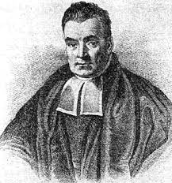
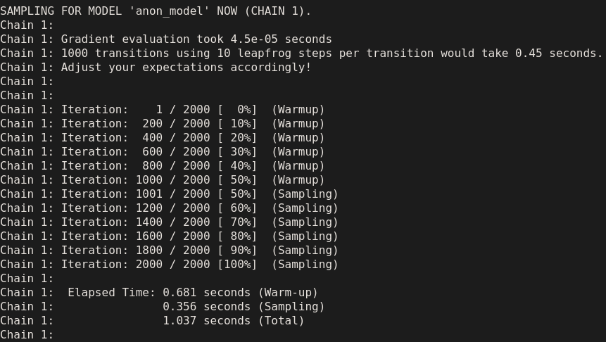

```{r setup, include=FALSE}
library(citr)
library(tidyverse)
library(magrittr)
library(lme4)
library(brms)
library(ggthemes)
library(kableExtra)
library(knitr)
library(readxl)
library(extrafont)
library(broom)
library(tidybayes)
library(janitor)
source("../scripts/functions.R")
options("kableExtra.html.bsTable" = T)
knitr::opts_chunk$set(echo = FALSE,
                      comment=NA, 
                      warning = FALSE,
                      message =FALSE)
theme_set(theme_few(base_size = 12) )
```


# Outline

## Outline

- Advantages of Bayesian inference
- Difference to (classical) frequentist approaches
- Fitting and comparing frequentist and Bayesian LMMs
- Evaluating a Bayesian model and model parameters

## Before we start ...

- Download the workshop folder.
- We will pull it from GitHub via RStudio.
- Open RStudio
- Link for workshop folder.
- Exercise scripts
- Some data
- Slides


# Two universes

## Two universes

- **Null-hypothesis significance testing (NHST)**
- **Bayesian statistics**
- The difference is the way we use to arrive at our inference.
- NHST: do we believe in the data if there's actually no effect?
- Bayesian: what's the probability of an effect given the data (and what we know from similar data)?


## Null-hypothesis significance testing (NHST)

$$
P(\text{data} \mid H_0 = \text{TRUE})
$$

- aka Frequentist statistics
- Inference: evaluating the probability of data assuming that the null hypothesis is true.
- If the data are extreme enough, the null hypothesis becomes implausible.
- Conclusion: the alternative hypothesis is assumed if the null hypothesis was rejected.
- Data are variable and parameters are fixed

## NHST and its problems

- Intuitive statistical significance is not a binary but continuous property
- *p*-values vs parameter estimation and Bayes Factors (compare probability models rather than testing against the null)
- What are you doing if *p*-value$=0.051$? 
- Trade-off small difference sample size
- Stopping rule
- Inference is based on a large number of fictional replications.
- $\alpha$-level of 0.05 implies that 5% of replications will:
    - detect an effect that isn't real 
    - do not detect and effect that is real

## Convergence failure for lmer models

- Maximal random effects structure [@baayen2008mixed;@barr2013random]
- (g)lmer fail to convergence 
- Overparametrisation: unidentifiable parameter estimates [@bates2015parsimonious]
- Solutions: reducing model complexity, changing optimisers
- The argument favouring a model becomes the failure to fit a possibly better model
- Certain sources of random errors are not addressed

## Why Bayesian?

It tells us what we want to know!

Given the data (and our prior knowledge),

> - What interval contains an unobserved parameter with .95 (or some other) probability?
> - What's the relative weight of evidence for one model (e.g., 'null') vs. another (e.g., an alternative)?


## Why Bayesian?

- Bayesian model converge *by definition* (as the number of iterations approaches $\infty$).
- Prior knowledge of reasonable parameter values.
- Results are not dependent on 'sampling plan' [@kruschke2018bayesian]
- Flexible packages are **now** readily available (e.g. brms, rstanarm, rethinking)
    

  
## Why Bayesian?

$$
p(H_0 = \text{TRUE} \mid \text{data})\\
\text{or}\\
p(H_1 = \text{TRUE} \mid \text{data})\\
\text{or}\\
p(H_1 = \text{FALSE} \mid \text{data})\\
$$

- Estimate credibility over parameter values based on the observed data [@kruschke2014doing].
- Given the data, what parameter values should we believe in with most confidence.
- For this we need to start with (1) a probability model and (2) *prior* expectation as to the parameter values of this model.

## Bayesian estimation | Bayes' Theorem 

$$
p(\theta \mid y) \propto p(\theta)p(y \mid \theta)
$$
- $\theta$ = parameter(s), $y$ = data, $\mid$ = given (conditional on)
- $p(y \mid \theta)$ = likelihood (similar to MLE in NHST)
- $p(\theta)$ = prior (what do we know about the parameter(s))
- $p(\theta \mid y)$ = posterior distribution (how much we believe in different parameter values after seeing the data)





## Bayesian estimation | Bayes' Theorem 

$$
p(\theta \mid y) \propto p(\theta)p(y \mid \theta)
$$

- The posterior is proportional to the prior times the likelihood.
- In maximum likelihood estimation we search for the parameters that maximize the (log) likelihood.
- For Bayesian estimation we use the likelihood to update our prior beliefs in different parameter values.
- Data are fixed and parameters are variable.
- Bayes' Theorem allows us to determine parameter values from the data (plus prior).
- This can be computationally demanding!


## brms [@brms1]

- *R* package for Bayesian models
- More probability models than other regressions packages
  - gaussian, lognormal, bernoulli, poisson, zero_inflated_poisson, skew_normal, shifted_lognormal, exgaussian, *et cetera*
  - and allows probabilistic mixture models, nonlinear regression models, equal variance signal-detection theory
- Under the hood: brms creates Stan code to compile an MCMC (Markov Chain Monte Carlo) sampler
- Compiling the sampler and for the sampler to obtain the full posterior takes times.
- Check and cite the tutorials of brms author Paul-Christian Bürkner's [@brms1; @brms2; @burkner2019ordinal; @burkner2019bayesian]


## Why is this important for linguistis?

- Beliefs about the hypothesis are directly based on the data as a probability distribution.
- Useful for small data sets in which prior information might play a huge role.
- Model many different data types (keystroke latencies, number of pauses, accuracy).
- Flexible ways of modelling data and deriving inference.
- Posterior sampling can handle missing data problems.


## Simulating data

<div style="float: left;width: 75%;">
```{r, eval = T, echo = T}
data <- jens_data_machine(intercept = 300, slope = 15)
```

```{r echo=F}
data %>%  slice(1:5) %>%
  kable("html", digits = c(0,0,0,2),
        align = c("r", "r", "r", "r")) %>%
  kable_styling(bootstrap_options = c("striped", "hover", "responsive"), font_size = 16) %>% scroll_box(width = "100%", height = "360px")
```


</div>

## Simulating data

<div style="float: left;width: 75%">

```{r, eval = F, echo = T}
data <- jens_data_machine(intercept = 300, slope = 15)
```

```{r echo = F, fig.height = 4}
ggplot(data, aes(x = condition, y = y)) +
  geom_jitter(size = .1, alpha = .5, shape = 1, width = .1) +
  geom_boxplot(fill="transparent", width = .25, outlier.shape = NA) +
  scale_y_continuous(breaks = seq(0, 600, 150))
```

</div>

<div style="float: left;width: 25%">

> - Think about it as keystroke intervals :)
> - Parameter of interest: difference between conditions.
> - After accounting for variability in the data associated with the sampling process.
> - Mixed-effects model combine fixed and random effects.

</div>


## Simulating data

```{r, eval = F, echo = T}
data <- jens_data_machine(intercept = 300, slope = 15)
```

```{r echo = F, fig.height = 4, fig.width=5.5}
data_sum <- data %>% group_by(participant_id, condition) %>%
  summarise(mean = mean(y)) %>%
  group_by(participant_id) %>%
  mutate(diff = ifelse(diff(mean)>0, TRUE, FALSE )) %>%
  group_by(condition) %>%
  mutate(N = n())

N <- unique(data_sum$N)

ggplot(data_sum, aes(x = condition, y = mean, colour = diff)) +
  geom_point(size = 3, alpha = .75, show.legend = F) +
  geom_path(aes(group = interaction(participant_id)), alpha = .5, show.legend = F) +
  labs(title = bquote("By-participant means ("*italic("N")==.(N)*")"), y = "y") +
  scale_color_colorblind()
```


## Formulating the model

$$
y_i \sim N(\mu_i, \sigma^2)\\
\mu_i = \beta_0 + \text{condition}_i\cdot\beta_1 + u_i\\
$$

- Outcome variable $y$
- Tilde symbol ($\sim$) represents "is a function of" or "comes from"
- Equal sign ($=$) is used for deterministic relationships
- $N$ is a Gaussian normal distribution with a mean $\mu$ and a residual (error) variance $\sigma^2$
- Greek symbols are used for population values (with caret for estimates, e.g. $\hat{\beta}$)

## Formulating the model

$$
y_i \sim N(\mu_i, \sigma^2)\\
\mu_i = \beta_0 + \text{condition}_i\cdot\beta_1 + u_i\\
$$


>- Treatment contrast: condition *a* = 0, condition *b* = 1 

```{r echo = T}
contrasts(factor(data$condition)) # default contrast
```

- We assume an additive normal probability model (likelihood).
- Given the data $y$ and this model, we can estimate $\beta_0$ and $\beta_1$ (for a Bayesian model we still need priors.)
- Intercept $\beta_0$: estimated mean of condition *a* (you see why?)
- Slope $\beta_1$: difference between condition *a* and condition *b*
- $u$ is participant variance with $N(0,\sigma_u)$


## *R*-syntax

> - Frequentist mixed-effects models

```{r eval=F, echo = T}
library(lme4)
fit_lmer <- lmer(y ~ 1 + condition + (1|participant_id), data = data)
```

> - Bayesian mixed-effects models

```{r eval=F, echo = T}
library(brms)
fit_brm <- brm(y ~ 1 + condition + (1|participant_id), data = data)
```


## Exercise: fit models on simulated data

- Complete and run script `lmer_sim.R` and `brms_sim.R`
- Replace "---"; run the script carefully line by line and check the output in the console.
- Inspect and compare the fixed effects summaries.


## Fit models on simulated data

<div style="float: left;width: 75%; height:50%">

```{r, eval = F, echo = T}
data <- jens_data_machine(intercept = 300, slope = 15)
```

```{r, eval = T, echo = T}
fit_lmer <- lmer(y ~ 1 + condition + (1|participant_id), data = data)
```

```{r}
fit_brm <- readRDS(file = "../stanout/brms_sim.rda")
```

```{r, eval = F, echo = T}
fit_brm <- brm(y ~ 1 + condition + (1|participant_id), data = data)
```


## Fit models on simulated data

<div style="float: left;width: 75%">

```{r, eval = F, echo = T}
data <- jens_data_machine(intercept = 300, slope = 15)
```

```{r echo = T}
coef(summary(fit_lmer)) # Coefficients of frequentist model
```


```{r echo = T}
fixef(fit_brm) # Coefficients of Bayesian model
```

</div>

## So what about this?

<div style="float: left;width: 55%">

{width=100%}
</div>

<div style="float: right;width: 40%">

- 2,000 iterations for parameter estimation per chain 
- `iterations / 2` warm-up samples: discarded eventually 
- 4 chains to establish convergence
- Parallelize chains by changing `cores` (check `parallel::detectCores()`)
- How many posterior samples have we got for our inference (`= chains * (iterations - warm-up)`)?
- How many iterations / chains do you need?
- Check [this link](https://www.barelysignificant.com/slides/RGUG2019#38)
</div>


## Parameter estimation

<div style="float: left;width: 40%">

- **Hamiltonian Monte Carlo:** Markov chain Monte Carlo method for obtaining random samples.
- Converge to being distributed according to a target probability distribution.
- Probability of values proposed by the sampler is estimated given the data and the prior.
- Direction changes if probability of proposed estimate is lower than previous one.
- Priors can be used to limit the parameter space (which is otherwise infinite) but are updated at every step.
- Parameter space is really multi-dimensional.

</div>

<div style="float: right;width: 55%">

```{r }

sim <- fit_brm$fit@sim
samples <- map(1:4, ~sim$samples[[.]] %>%
                 as_tibble() %>%
      select(starts_with("b")) %>%
      mutate(chain = .x,
             iteration = 1:n())) %>% bind_rows() %>%
    pivot_longer(starts_with("b")) %>%
  mutate(name = factor(name, levels = unique(name)[c(1,2)], ordered = T),
         chain = factor(chain))
```

```{r fig.width=5}
pivot_wider(samples, names_from = name, values_from = value) %>%
  filter(chain == 1) %>%
  mutate(chain = paste0("Chain: ", chain)) %>%
  ggplot(aes(x = b_Intercept, y = b_conditionb, colour = chain)) +
  scale_color_viridis_d("") +
  geom_path(show.legend = F) +
  facet_wrap(~chain) +
  labs(title = "Parameter space") +
  scale_x_continuous(limits = c(-100, 400), breaks = seq(-150, 600, 150)) +
  scale_y_continuous(limits = c(-50, 100), breaks = seq(-150, 600, 50)) +
  theme(legend.justification = "top")
```

</div>


## Parameter estimation

```{r fig.height = 4}
ggplot(samples, aes(y=value, x = iteration, colour = chain)) +
  scale_color_viridis_d("Chains") +
  geom_path() +
  facet_wrap(~name, scales = "free") +
  annotate("rect", xmin = 0, xmax = 1000, ymin = -Inf, ymax = Inf,
        alpha = .2) +
  labs(title = "Traceplot")
```


## Parameter estimation

```{r}
samples %>%
  filter(chain %in% 1, iteration %in% 1:100) %>%
  ggplot(aes(y=value, x = iteration, colour = chain)) +
  scale_color_viridis_d("Chains") +
  geom_path() +
  facet_wrap(~name, scales = "free") +
  labs(title = "Traceplot")
```


## Parameter estimation

```{r}
samples %>%
  filter(chain %in% 1:2, iteration %in% 1:100) %>%
  ggplot(aes(y=value, x = iteration, colour = chain)) +
  scale_color_viridis_d("Chains") +
  geom_path() +
  facet_wrap(~name, scales = "free") +
  labs(title = "Traceplot")
```


## Parameter estimation

```{r}
samples %>%
  filter(chain %in% 1:4, iteration %in% 1:100) %>%
  ggplot(aes(y=value, x = iteration, colour = chain)) +
  scale_color_viridis_d("Chains") +
  geom_path() +
  facet_wrap(~name, scales = "free") +
  labs(title = "Traceplot")
```


## Parameter estimation

```{r}
samples %>%
  filter(chain %in% 1:4, iteration %in% 1:250) %>%
  ggplot(aes(y=value, x = iteration, colour = chain)) +
  scale_color_viridis_d("Chains") +
  geom_path() +
  facet_wrap(~name, scales = "free") +
  labs(title = "Traceplot")
```

## Parameter estimation

```{r}
samples %>%
  filter(chain %in% 1:4, iteration %in% 1:500) %>%
  ggplot(aes(y=value, x = iteration, colour = chain)) +
  scale_color_viridis_d("Chains") +
  geom_path() +
  facet_wrap(~name, scales = "free") +
  labs(title = "Traceplot")
```


## Parameter estimation

```{r}
samples %>%
  filter(chain %in% 1:4, iteration %in% 1:2000) %>%
  ggplot(aes(y=value, x = iteration, colour = chain)) +
  scale_color_viridis_d("Chains") +
  geom_path() +
  facet_wrap(~name, scales = "free") +
  labs(title = "Traceplot")
```

## Parameter estimation

```{r}
samples %>%
  filter(chain %in% 1:4, iteration %in% 1000:2000) %>%
  ggplot(aes(y=value, x = iteration, colour = chain)) +
  scale_color_viridis_d("Chains") +
  geom_path() +
  facet_wrap(~name, scales = "free") +
  labs(title = "Traceplot")
```

## Model diagnostics

- $\hat{R}$ (*R*-hat) convergence statistic; should be $<$1.1 [@gelman1992]

```{r eval = F, echo = T}
rhat(fit_brm, pars = c("b_Intercept", "b_conditionb")) 
```

- Traceplots: we want fat hairy caterpillars 

```{r eval = F, echo = T}
plot(fit_brm, pars = c("b_Intercept", "b_conditionb"))
```

- Posterior predictive checks: compare observed data $y$ and model predictions $y_{rep}$

```{r eval=F, echo = T}
pp_check(fit_brm, nsamples = 100)
```


```{r}
## Posterior: parameter estimates
#stanplot(fit_brm, pars = "^b_")
## Posterior: conditional effects
#conditional_effects(fit_brm)
```


## Exercise: model diagnostics

- Open the scripts `model_diagnostics.R`
- Replace the "---"s appropriately.
- Run the code (line by line)


## Posterior: probability distribution


>- Get posterior of slope $\beta$ (difference between conditions)

```{r echo = T}
beta <- posterior_samples(fit_brm, pars = "b_conditionb") %>% pull()
length(beta)
beta[1:5]
```


## Posterior: probability distribution

```{r } 
ggplot(data = NULL, aes(x = beta)) +
  geom_histogram(alpha = .55) +
  labs(x = bquote("Estimated effect"~hat(beta)),
       title = "Posterior probability distribution")
```


## Posterior: probability distribution

<div style="float: left;width: 45%">

>- Posterior mean

```{r echo = T}
mean(beta)
```

</div>

<div style="float: left;width: 55%">

```{r fig.height=4.5, fig.width=5.5}
ggplot(data = NULL, aes(x = beta)) +
  geom_histogram(alpha = .55) +
  labs(x = bquote("Estimated effect"~hat(beta)), title = "Posterior probability distribution") +
  geom_vline(xintercept = mean(beta), color = "darkred")
```
</div>


## Posterior: probability distribution

<div style="float: left;width: 45%">

>- 95% probability interval (conceptually different from confidence interval)

```{r echo = T}
quantile(beta, probs = c(0.025, 0.975))
```

>- 89% probability interval [@mcelreath2016statistical]

```{r echo = T}
quantile(beta, probs = c(0.055, 0.945))
```

</div>

<div style="float: left;width: 55%">

```{r fig.height=4.5, fig.width=5.5}
ggplot(data = NULL, aes(x = beta)) +
  geom_histogram(alpha = .55) +
  labs(x = bquote("Estimated effect"~hat(beta)), title = "Posterior probability distribution") +
  geom_errorbarh(aes(y = 65, xmin = quantile(beta, probs = c(0.025))
, xmax =  quantile(beta, probs = c(0.975))), color = "darkred", size = 1.5, ) +
  annotate("text", x = 15, y = 90, label = "95% PI", colour = "darkred")
```
</div>

## Posterior: probability distribution

<div style="float: left;width: 45%">

>- 95% probability interval (conceptually different from confidence interval)

```{r echo = T}
quantile(beta, probs = c(0.025, 0.975))
```

>- 89% probability interval [@mcelreath2016statistical]

```{r echo = T}
quantile(beta, probs = c(0.055, 0.945))
```

</div>

<div style="float: left;width: 55%">

```{r fig.height=4.5, fig.width=5.5}
ggplot(data = NULL, aes(x = beta)) +
  geom_histogram(alpha = .55) +
  labs(x = bquote("Estimated effect"~hat(beta)), title = "Posterior probability distribution") +
  geom_errorbarh(aes(y = 65, xmin = quantile(beta, probs = c(0.055))
, xmax =  quantile(beta, probs = c(0.945))), color = "darkred", size = 1.5, ) +
  annotate("text", x = 15, y = 90, label = "89% PI", colour = "darkred")
```
</div>


## Posterior: probability distribution

<div style="float: left;width: 45%">

>- Probability that slope $\beta$ is negative: $P(\hat{\beta}<0)$

```{r echo = T}
mean(beta < 0)
```

>- Probability that slope $\beta$ is smaller than 10: $P(\hat{\beta}<10)$

```{r echo = T}
mean(beta < 10)
```

</div>

<div style="float: left;width: 55%">

```{r fig.height=4.5, fig.width=5.5}
beta2 <- beta[beta < 0]
ggplot(data = NULL, aes(x = beta, fill = beta > -1)) +
  geom_histogram(alpha = .55, position = "identity", show.legend = F) +
  scale_fill_manual(values = c("darkred", "grey")) +
  geom_vline(xintercept = 0, colour = "grey20", linetype = "dotted") +
  labs(x = bquote("Estimated effect"~hat(beta)), title = "Posterior probability distribution") 
```
</div>


## Posterior: probability distribution

<div style="float: left;width: 45%">

>- Probability that slope $\beta$ is negative: $P(\hat{\beta}<0)$

```{r echo = T}
mean(beta < 0)
```

>- Probability that slope $\beta$ is smaller than 10: $P(\hat{\beta}<10)$

```{r echo = T}
mean(beta < 10)
```

</div>

<div style="float: left;width: 55%">

```{r fig.height=4.5, fig.width=5.5}
ggplot(data = NULL, aes(x = beta, fill = beta > 9.5)) +
  geom_histogram(alpha = .55,  position = "identity", show.legend = F) +
  geom_vline(xintercept = 10, colour = "grey20", linetype = "dotted") +
  scale_fill_manual(values = c("darkred", "grey")) +
  labs(x = bquote("Estimated effect"~hat(beta)), title = "Posterior probability distribution") 
```
</div>


## ROPE

<div style="float: left;width: 55%">

- Region of practical equivalence: range of values that are practically equivalent [@kruschke2010believe; @kruschke2011bayesian].
- Point values don't represent our beliefs about what the null hypothesis is like: $H_0 = 0$
- The ROPE is the range of values that are practically equivalent to a null effect.
- Define region that is equivalent to no effect: all values in interval [-5, 5] 

</div>


## ROPE

<div style="float: left;width: 55%">

> - Region of practical equivalence: range of values that are practically equivalent [@kruschke2010believe; @kruschke2011bayesian].
> - Point values don't represent our beliefs about what the null hypothesis is like: $H_0 = 0$
> - The ROPE is the range of values that are practically equivalent to a null effect.
> - Define region that is equivalent to no effect: all values in interval [-5, 5] 

```{r echo = T}
library(bayestestR)
rope(beta, range = c(-5, 5)) 
```
</div>


## ROPE

<div style="float: left;width: 55%">

> - Region of practical equivalence: range of values that are practically equivalent [@kruschke2010believe; @kruschke2011bayesian].
> - Point values don't represent our beliefs about what the null hypothesis is like: $H_0 = 0$
> - The ROPE is the range of values that are practically equivalent to a null effect.
> - Define region that is equivalent to no effect: all values in interval [-5, 5] 

```{r echo = T}
library(bayestestR)
rope(beta, range = c(-5, 5)) 
```
</div>


<div style="float: right;width: 45%">

```{r fig.height=4.5, fig.width=4.5}
ggplot(data = NULL, aes(x = beta, fill = beta > -5 & beta < 5)) +
  geom_histogram(alpha = .55,  position = "identity", show.legend = F) +
  geom_vline(xintercept = 5, colour = "grey20", linetype = "dotted") +
  geom_vline(xintercept = -5, colour = "grey20", linetype = "dotted") +
  scale_fill_manual(values = c("grey", "darkred")) +
  labs(x = bquote("Estimated effect"~hat(beta)), title = "Posterior probability distribution") 
```
</div>


## ROPE

<div style="float: left;width: 55%">

> - Region of practical equivalence: range of values that are practically equivalent [@kruschke2010believe; @kruschke2011bayesian].
> - Point values don't represent our beliefs about what the null hypothesis is like: $H_0 = 0$
> - The ROPE is the range of values that are practically equivalent to a null effect.
> - Define region that is equivalent to no effect: all values in interval [-Inf, 5] 

```{r echo = T}
library(bayestestR)
rope(beta, range = c(-Inf, 5))
```
</div>


<div style="float: left;width: 45%">

```{r fig.height=4.5, fig.width=4.5}
ggplot(data = NULL, aes(x = beta, fill = beta > -Inf & beta < 5)) +
  geom_histogram(alpha = .55,  position = "identity", show.legend = F) +
  geom_vline(xintercept = 5, colour = "grey20", linetype = "dotted") +
  scale_fill_manual(values = c("grey", "darkred")) +
  labs(x = bquote("Estimated effect"~hat(beta)), title = "Posterior probability distribution") 
```
</div>


## ROPE

- Determine ROPE to assess the uncertainty of effect size [@makowski2019bayestestr]
- Calculate the standardised effect size $\delta$ from posterior: $\delta = \frac{\beta}{\sigma}$ 
- ROPE of [-0.1, 0.1] is the range of negligible effect sizes [@cohn1988statistical;@kruschke2018rejecting]. 

## ROPE


>- Determine ROPE to assess the uncertainty of effect size [@makowski2019bayestestr]
>- Calculate the standardised effect size $\delta$ from posterior: $\delta = \frac{\beta}{\sigma}$ 
>- ROPE of [-0.1, 0.1] is the range of negligible effect sizes [@cohn1988statistical;@kruschke2018rejecting]. 

```{r echo = T}
sigma <- posterior_samples(fit_brm, pars = "sigma") %>% pull()
delta <- beta / sigma
```

```{r echo = T}
mean(delta) # small effect (see Cohen's d)
```

## ROPE

>- Determine ROPE to assess the uncertainty of effect size [@makowski2019bayestestr]
>- Calculate the standardised effect size $\delta$ from posterior: $\delta = \frac{\beta}{\sigma}$ 
>- ROPE of [-0.1, 0.1] is the range of negligible effect sizes [@cohn1988statistical;@kruschke2018rejecting]. 

```{r echo = T}
rope(delta, range = c(-0.1, 0.1)) 
```

- The ROPE value indicates the extent to which the posterior cannot rule out a negligible effect. 
- A meaningful effect size should have a small proportion of posterior samples within the ROPE. 


## Final exercise: parameter evaluation

- Open the script `parameter_evaluation.R`
- Work through each line of code: complete the missing bits ("---") 
- Check out the output.


# The end


## For next session

- We will compare different models of keystroke intervals.
- Run the following models and save their posterior:
  - `gaussian_sentence.R`
  - `lognormal_sentence.R`
  - `exgaussian_sentence.R`
  - `mixture_model_sentence.R`
  - `skewnormal_sentence.R` (don't run this one, if you don't have time)
- Don't worry if you don't know what they do (yet), we just need the posterior of these models for the next session.


## References

<style>
slides > slide { overflow: scroll; }
slides > slide:not(.nobackground):after {
  content: '';
}
</style>

