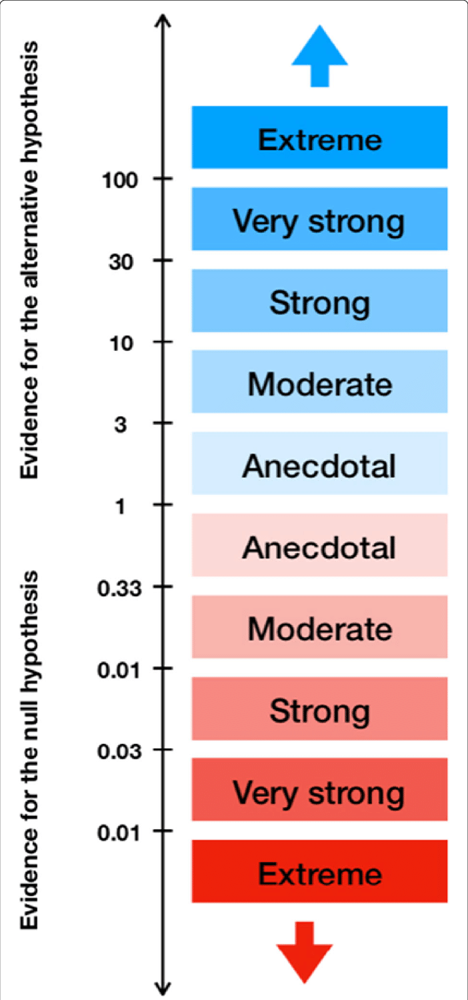
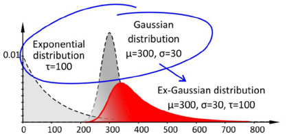

```{r setup, include=FALSE}
library(citr)
library(tidyverse)
library(magrittr)
library(lme4)
library(brms)
library(ggthemes)
library(kableExtra)
library(knitr)
library(readxl)
library(extrafont)
library(broom)
library(tidybayes)
library(janitor)
library(patchwork)
library(mixtools)
source("../scripts/functions.R")
options("kableExtra.html.bsTable" = T)
knitr::opts_chunk$set(echo = FALSE,
                      comment=NA, 
                      warning = FALSE,
                      message =FALSE)
theme_set(theme_few(base_size = 13))
data <- read_csv("../data/sentence_transitions.csv")
```


# Outline

## Outline

- Priors
- Bayes Factors   
- Families of distributions
- Models of keystroke data
- Reading recommendations


# Priors

## Priors

- Prior knowledge about parameters.
- Helps parameter estimation by limiting the parameter space.
- Where does the sampler has to search for the target distribution.
- This knowledge is expressed as probability distributions (e.g. a normal distribution).
- Small data samples are sensitive to prior information.
- Data overcome the prior (automatic Ockham's razor).
- Bayes Factors are affected by priors (see later).
- We know aready a lot that we can use!

## Priors: intercept

<div style="float: left;width: 40%;">

- We want to help our sampler!
- Let's think about keystroke intervals.
- Intercepts are some form of average (depending on contrast coding).
- Can keystroke intervals range between -$\infty$ and $\infty$? 

</div>

<div style="float: right;width: 50%;">

```{r fig.width=5}
tibble(intercept = runif(1000, -100000, 100000),
       slope = runif(1000,  -10000, 10000)) %>%
  ggplot(aes(x=intercept, y=slope)) 
```
</div>

## Priors

<div style="float: left;width: 40%;">

>- We want to help our sampler!
>- Let's think about keystroke intervals.
>- Intercepts are some form of average (depending on contrast coding).
>- Can keystroke intervals range between -$\infty$ and $\infty$? 
- What the lower and upper end?

</div>


<div style="float: right;width: 50%;">

```{r fig.width=5}
tibble(intercept = runif(1000, -100000, 100000),
       slope = runif(1000,  -10000, 10000)) %>%
  ggplot(aes(x=intercept, y=slope)) 
```
</div>


## Priors

<div style="float: left;width: 40%;">

>- We want to help our sampler!
>- Let's think about keystroke intervals.
>- Intercepts are some form of average (depending on contrast coding).
>- Can keystroke intervals range between -$\infty$ and $\infty$? 
>- What the lower and upper end?
- How long is the average pause before a sentence?


$$
\text{pre-sentence pause} \sim N(???, ???)
$$
</div>


<div style="float: right;width: 50%;">

```{r fig.width=5}
tibble(intercept = runif(1000, 0, 100000),
       slope = runif(1000,  -10000, 10000)) %>%
  ggplot(aes(x=intercept, y=slope)) 
```

</div>


## Priors

<div style="float: left;width: 40%;">

>- We want to help our sampler!
>- Let's think about keystroke intervals.
>- Intercepts are some form of average (depending on contrast coding).
>- Can keystroke intervals range between -$\infty$ and $\infty$? 
>- What the lower and upper end?
- How long is the average pause before a sentence?


$$
\text{pre-sentence pause} \sim N(2000 \text{ msecs}, ???)
$$
</div>


<div style="float: right;width: 50%;">

```{r fig.width=5}
tibble(intercept = runif(1000, 0, 100000),
       slope = runif(1000,  -10000, 10000)) %>%
  ggplot(aes(x=intercept, y=slope)) 
```

</div>


## Priors

<div style="float: left;width: 40%;">

>- We want to help our sampler!
>- Let's think about keystroke intervals.
>- Intercepts are some form of average (depending on contrast coding).
>- Can keystroke intervals range between -$\infty$ and $\infty$? 
>- What the lower and upper end?
- How long is the average pause before a sentence?
- How short / long can this be?
- Plausible probability distribution for pre-sentence pauses:

$$
\text{pre-sentence pause} \sim N(2000 \text{ msecs}, ???)
$$
</div>


<div style="float: right;width: 50%;">

```{r fig.width=5}
tibble(intercept = runif(1000, 0, 200000),
       slope = runif(1000,  -10000, 10000)) %>%
  ggplot(aes(x=intercept, y=slope)) 
```

</div>

## Priors

<div style="float: left;width: 40%;">

>- We want to help our sampler!
>- Let's think about keystroke intervals.
>- Intercepts are some form of average (depending on contrast coding).
>- Can keystroke intervals range between -$\infty$ and $\infty$? 
>- What the lower and upper end?
- How long is the average pause before a sentence?
- How short / long can this be?
- Plausible probability distribution for pre-sentence pauses:


$$
\text{pre-sentence pause} \sim N(2000 \text{ msecs}, 1000\text{ msecs})
$$
</div>


<div style="float: right;width: 50%;">

```{r fig.width=5}
tibble(intercept = runif(1000, 0, 200000),
       slope = runif(1000,  -10000, 10000)) %>%
  ggplot(aes(x=intercept, y=slope)) 
```

</div>


## Priors

<div style="float: left;width: 40%;">

>- We want to help our sampler!
>- Let's think about keystroke intervals.
>- Intercepts are some form of average (depending on contrast coding).
>- Can keystroke intervals range between -$\infty$ and $\infty$? 
>- What the lower and upper end?
>- How long is the average pause before a sentence?
>- How short / long can this be?
- Plausible probability distribution for pre-sentence pauses:


$$
\text{pre-sentence pause} \sim N(2000 \text{ msecs}, 1000\text{ msecs})
$$
</div>


<div style="float: right;width: 50%;">

```{r fig.width=5}
p <- tibble(intercept = rnorm(10000, mean = 2000, sd = 1000),
       slope = runif(10000,  -10000, 10000)) %>%
  ggplot(aes(x=intercept, y=slope)) +
    geom_point(size = .25, colour = "transparent") + 
  geom_density_2d_filled(alpha = 0.25, show.legend = F) +
  geom_density_2d(alpha = 0.5, show.legend = F, size = .15, color = "black") +
  scale_fill_viridis_d(direction = -1, begin = 0, end = .6) +
  scale_x_continuous(limits = c(0, 20000))

ggExtra::ggMarginal(p, type="density", size=10, alpha = .25, margins = "x")
```

</div>

## Priors

<div style="float: left;width: 50%;">

- Say, we compare people writing in L1 and L2.
- Writing in L2 can be harder because retrieving the correct word takes longer.
- What is a plausible prior for this delay?


</div>

<div style="float: right;width: 50%;">

```{r fig.width=5}
p <- tibble(intercept = rnorm(10000, mean = 2000, sd = 1000),
       slope = runif(10000,  -10000, 10000)) %>%
  ggplot(aes(x=intercept, y=slope)) +
    geom_point(size = .25, colour = "transparent") + 
  geom_density_2d_filled(alpha = 0.25, show.legend = F) +
  geom_density_2d(alpha = 0.5, show.legend = F, size = .15, color = "black") +
  scale_fill_viridis_d(direction = -1, begin = 0, end = .6) +
  scale_x_continuous(limits = c(0, 20000))

ggExtra::ggMarginal(p, type="density", size=10, alpha = .25, margins = "x")
```

</div>


## Priors

<div style="float: left;width: 50%;">

- Say, we compare people writing in L1 and L2.
- Writing in L2 can be harder because retrieving the correct word takes longer.
- What is a plausible prior for this delay?


$$
\text{slowdown for L2s} \sim N(???, ???)
$$
</div>

<div style="float: right;width: 50%;">

```{r fig.width=5}
p <- tibble(intercept = rnorm(10000, mean = 2000, sd = 1000),
       slope = runif(10000,  -10000, 10000)) %>%
  ggplot(aes(x=intercept, y=slope)) +
    geom_point(size = .25, colour = "transparent") + 
  geom_density_2d_filled(alpha = 0.25, show.legend = F) +
  geom_density_2d(alpha = 0.5, show.legend = F, size = .15, color = "black") +
  scale_fill_viridis_d(direction = -1, begin = 0, end = .6) +
  scale_x_continuous(limits = c(0, 20000))

ggExtra::ggMarginal(p, type="density", size=10, alpha = .25, margins = "x")
```

</div>


## Priors

<div style="float: left;width: 50%;">

>- Say, we compare people writing in L1 and L2.
>- Writing in L2 can be harder because retrieving the correct word takes longer.
>- What is a plausible prior for this delay?


$$
\text{slowdown for L2s} \sim N(250 \text{ msecs}, 100\text{ msecs})
$$
</div>

<div style="float: right;width: 50%;">

```{r fig.width=5}
p <- tibble(intercept = rnorm(10000, mean = 2000, sd = 1000),
       slope = runif(10000,  -10000, 10000)) %>%
  ggplot(aes(x=intercept, y=slope)) +
    geom_point(size = .25, colour = "transparent") + 
  geom_density_2d_filled(alpha = 0.25, show.legend = F) +
  geom_density_2d(alpha = 0.5, show.legend = F, size = .15, color = "black") +
  scale_fill_viridis_d(direction = -1, begin = 0, end = .6) +
  scale_x_continuous(limits = c(0, 20000))

ggExtra::ggMarginal(p, type="density", size=10, alpha = .25, margins = "x")
```

</div>


## Priors

<div style="float: left;width: 50%;">

>- Say, we compare people writing in L1 and L2.
>- Writing in L2 can be harder because retrieving the correct word takes longer.
>- What is a plausible prior for this delay?


$$
\text{slowdown for L2s} \sim N(250 \text{ msecs}, 100\text{ msecs})
$$
</div>

<div style="float: right;width: 50%;">

```{r fig.width=5}
p <- tibble(intercept = rnorm(10000, mean = 2000, sd = 1000),
       slope = rnorm(10000,  250, 100)) %>%
  ggplot(aes(x=intercept, y=slope)) +
    geom_point(size = .25, colour = "transparent") + 
  geom_density_2d_filled(alpha = 0.25, show.legend = F) +
  geom_density_2d(alpha = 0.5, show.legend = F, size = .15, color = "black") +
  scale_fill_viridis_d(direction = -1, begin = 0, end = .6) +
  scale_x_continuous(limits = c(0, 20000)) +
  scale_y_continuous(limits = c(-300,1000), breaks = seq(-300, 900, 300))
ggExtra::ggMarginal(p, type="density", size=10, alpha = .25, margins = "both")
```

</div>


## Priors

<div style="float: left;width: 50%;">

- We often don't know what the slope is or don't want to make strong claims about effects.
- However, we still have an intuition what effects are plausible and which aren't.
- Say, words with alternative spellings (*accordian*, *accordion*) may or may not lead to longer pauses (that words with less possible spellings; *aspergus*).
- We don't know that, so lets use a mean of 0 msecs; what would be a possible $\sigma$?

</div>


## Priors

<div style="float: left;width: 50%;">

>- We often don't know what the slope is or don't want to make strong claims about effects.
>- However, we still have an intuition what effects are plausible and which aren't.
>- Say, words with alternative spellings (*accordian*, *accordion*) may or may not lead to longer pauses (that words with less possible spellings; *aspergus*).
>- We don't know that, so lets use a mean of 0 msecs; what would be a possible $\sigma$?

$$
\text{slope} \sim N(0 \text{ msecs}, ???)
$$

</div>

## Priors

<div style="float: left;width: 50%;">

>- We often don't know what the slope is or don't want to make strong claims about effects.
>- However, we still have an intuition what effects are plausible and which aren't.
>- Say, words with alternative spellings (*accordian*, *accordion*) may or may not lead to longer pauses (that words with less possible spellings; *aspergus*).
>- We don't know that, so lets use a mean of 0 msecs; what would be a possible $\sigma$?

$$
\text{slope} \sim N(0 \text{ msecs}, 100\text{ msecs})
$$

</div>


## Priors

<div style="float: left;width: 50%;">

>- We often don't know what the slope is or don't want to make strong claims about effects.
>- However, we still have an intuition what effects are plausible and which aren't.
>- Say, words with alternative spellings (*accordian*, *accordion*) may or may not lead to longer pauses (that words with less possible spellings; *aspergus*).
>- We don't know that, so lets use a mean of 0 msecs; what would be a possible $\sigma$?


$$
\text{slope} \sim N(0 \text{ msecs}, 100\text{ msecs})
$$
</div>

<div style="float: right;width: 50%;">


```{r fig.width=5}
p <- tibble(intercept = rnorm(10000, mean = 2000, sd = 1000),
       slope = rnorm(10000,  0, 100)) %>%
  ggplot(aes(x=intercept, y=slope)) +
    geom_point(size = .25, colour = "transparent") + 
  geom_density_2d_filled(alpha = 0.25, show.legend = F) +
  geom_density_2d(alpha = 0.5, show.legend = F, size = .35, color = "black") +
  scale_fill_viridis_d(direction = -1, begin = 0, end = .6) +
  scale_x_continuous(limits = c(0, 20000)) +
  scale_y_continuous(limits = c(-300,1000), breaks = seq(-300, 900, 300))

ggExtra::ggMarginal(p, type="density", size=10, alpha = .25, margins = "both")
```
</div>


## Priors

<div style="float: left;width: 50%;">

- Even **weakly informative** priors are helpful for estimating parameter values.
- They help to constrain the parameter space.
- The parameter space should reflect what we think is plausible.
- This is especially important for more complex models such as mixtures and Wiener diffusion models.
</div>


<div style="float: right;width: 50%;">


```{r fig.width=5}
p <- tibble(intercept = rnorm(10000, mean = 2000, sd = 1000),
       slope = rnorm(10000,  0, 100)) %>%
  ggplot(aes(x=intercept, y=slope)) +
    geom_point(size = .25, colour = "transparent") + 
  geom_density_2d_filled(alpha = 0.25, show.legend = F) +
  geom_density_2d(alpha = 0.5, show.legend = F, size = .35, color = "black") +
  scale_fill_viridis_d(direction = -1, begin = 0, end = .6) +
  scale_x_continuous(limits = c(0, 20000)) +
  scale_y_continuous(limits = c(-300,1000), breaks = seq(-300, 900, 300))

ggExtra::ggMarginal(p, type="density", size=10, alpha = .25, margins = "both")
```
</div>

## Priors

- Check defaults used last session:

```{r echo = T, eval = F}
fit_brm <- readRDS(file = "../stanout/brms_sim.rda")
prior_summary(fit_brm)
```

```{r echo = F, eval = T}
fit_brm <- readRDS(file = "../stanout/brms_sim.rda")
prior <- prior_summary(fit_brm) # %>% as_data_frame() %>% select(-source)
prior %>% as_tibble() %>%
  mutate(prior = ifelse(class == "b", "(flat)", prior)) %>%
  select(prior:group) %>% kable() %>%
  kable_styling("striped", full_width = F) %>%
  column_spec(1, width = "20em") %>%
  column_spec(2:4, width = "10em") 
```


## Priors


```{r echo = T, eval = F}
# Create model
model <- bf(outcome ~ predictor + (1|participant))
# specifying model outside of brms works for lmer too.
# bf = brmsformula

# Look at priors: some have reasonable defaults, others are flat.
get_prior(model, data = data)


# Specify priors
prior <- set_prior("normal(2000, 1000)", class = "Intercept", lb = 0, ub = 10000) +
  set_prior("normal(0, 100)", class = "b") 


# Fit brms
fit <- brm(model, data = data, prior = prior)
```


## Exercise

- Adding priors to last session's model:
- `brms_sim_with_prior.R`
- If you have time, make the variance of the prior for the slope $\beta$ either much larger or smaller and check how this affects the posterior coefficients.


# Bayes Factor

## Bayes Factor

<div style="float: left;width: 75%;">

- Savage-Dickey density ratio for nested models [@jeffreys1961theory; @dickey1970weighted]
- Height of the posterior at zero compared to the height of the prior at zero
- How much more probable is one model (hypothesis) over the other?


$$
\text{BF}_{01} = \frac{p(H_0 \mid y)}{p(H_1 \mid y)} \\
= \frac{\text{posterior}}{\text{prior}}
$$

</div>


## Bayes Factor

<div style="float: left;width: 75%;">

>- Savage-Dickey density ratio for nested models [@jeffreys1961theory; @dickey1970weighted]
>- Height of the posterior at zero compared to the height of the prior at zero
>- How much more probable is one model (hypothesis) over the other?


$$
\text{BF}_{10} = \frac{p(H_1 \mid y)}{p(H_0 \mid y)} \\
= \frac{\text{prior}}{\text{posterior}}
$$

</div>

<div style="float: right;width: 20%;">

{height="105%" width="105%"}
</div>


## Bayes Factor: Savage-Dickey density ratio

<div style="float: left;width: 25%;">

- Posterior: $N(2.5, 1)$
- Prior: $N(0,10)$

</div>

<div style="float: right;width: 60%;">


```{r fig.width=5}
pd <- tibble(x = seq(-5, 5, by = .1),
             Prior = dnorm(x, 0, 10),
             Posterior = dnorm(x, 2.5, 1)) %>%
  pivot_longer(Prior:Posterior)

data_at_zero <- filter(pd, x == 0)
pr <- filter(data_at_zero, name == "Prior") %>% pull(value)
po <- filter(data_at_zero, name == "Posterior") %>% pull(value)

ggplot(pd, aes(x = x, y = value, colour = name)) +
  geom_line() +
  geom_point(data = data_at_zero, aes(x = x, y = value), 
             colour = "black", size = 2) +
  geom_label(data = data_at_zero, aes(x = x, y = value + .02, label = round(value, 3)), 
             colour = "black", size = 3) +
  scale_color_colorblind("") +
  labs(y = "density", x = bquote(hat(beta)), subtitle = bquote("BF"[10]==.(round(pr/po,2)))) +
  theme(legend.position = c(0.25,.9),
        legend.direction = "horizontal")
```
</div>


## Bayes Factor: Savage-Dickey density ratio

<div style="float: left;width: 25%;">

>- Posterior: $N(2.5, 1)$
- Prior: $N(0,5)$

</div>

<div style="float: right;width: 60%;">


```{r fig.width=5}
pd <- tibble(x = seq(-5, 5, by = .1),
             Prior = dnorm(x, 0, 5),
             Posterior = dnorm(x, 2.5, 1)) %>%
  pivot_longer(Prior:Posterior)

data_at_zero <- filter(pd, x == 0)
pr <- filter(data_at_zero, name == "Prior") %>% pull(value)
po <- filter(data_at_zero, name == "Posterior") %>% pull(value)

ggplot(pd, aes(x = x, y = value, colour = name)) +
  geom_line() +
  geom_point(data = data_at_zero, aes(x = x, y = value), 
             colour = "black", size = 2) +
  geom_label(data = data_at_zero, aes(x = x, y = value + .02, label = round(value, 3)), 
             colour = "black", size = 3) +
  scale_color_colorblind("") +
  labs(y = "density", x = bquote(hat(beta)), subtitle = bquote("BF"[10]==.(round(pr/po,2)))) +
  theme(legend.position = c(0.25,.9),
        legend.direction = "horizontal")
```
</div>


## Bayes Factor: Savage-Dickey density ratio

<div style="float: left;width: 25%;">

>- Posterior: $N(2.5, 1)$
- Prior: $N(0,2.5)$

</div>

<div style="float: right;width: 60%;">


```{r fig.width=5}
pd <- tibble(x = seq(-5, 5, by = .1),
             Prior = dnorm(x, 0, 2.5),
             Posterior = dnorm(x, 2.5, 1)) %>%
  pivot_longer(Prior:Posterior)

data_at_zero <- filter(pd, x == 0)
pr <- filter(data_at_zero, name == "Prior") %>% pull(value)
po <- filter(data_at_zero, name == "Posterior") %>% pull(value)

ggplot(pd, aes(x = x, y = value, colour = name)) +
  geom_line() +
  geom_point(data = data_at_zero, aes(x = x, y = value), 
             colour = "black", size = 2) +
  geom_label(data = data_at_zero, aes(x = x, y = value + .02, label = round(value, 3)), 
             colour = "black", size = 3) +
  scale_color_colorblind("") +
  labs(y = "density", x = bquote(hat(beta)), subtitle = bquote("BF"[10]==.(round(pr/po,2)))) +
  theme(legend.position = c(0.25,.9),
        legend.direction = "horizontal")
```
</div>


## Bayes Factor: Savage-Dickey density ratio

<div style="float: left;width: 25%;">

>- Posterior: $N(2.5, 1)$
- Prior: $N(0,1)$

</div>

<div style="float: right;width: 60%;">


```{r fig.width=5}
pd <- tibble(x = seq(-5, 5, by = .1),
             Prior = dnorm(x, 0, 1.5),
             Posterior = dnorm(x, 2.5, 1)) %>%
  pivot_longer(Prior:Posterior)

data_at_zero <- filter(pd, x == 0)
pr <- filter(data_at_zero, name == "Prior") %>% pull(value)
po <- filter(data_at_zero, name == "Posterior") %>% pull(value)

ggplot(pd, aes(x = x, y = value, colour = name)) +
  geom_line() +
  geom_point(data = data_at_zero, aes(x = x, y = value), 
             colour = "black", size = 2) +
  geom_label(data = data_at_zero, aes(x = x, y = value + .02, label = round(value, 3)), 
             colour = "black", size = 3) +
  scale_color_colorblind("") +
  labs(y = "density", x = bquote(hat(beta)), subtitle = bquote("BF"[10]==.(round(pr/po,2)))) +
  theme(legend.position = c(0.25,.9),
        legend.direction = "horizontal")
```
</div>


## Bayes Factor

```{r eval = F, echo = T}
prior <- set_prior("normal(0, 1)", class = "b")
```


```{r eval = F, echo = T}
fit <- brm(model, 
           data = data, 
           prior = prior, 
           sample_prior = TRUE)
```

- Flat priors are okay defaults if $H_0$ and $H_1$ are plausible.
- More informative priors such as $N(0,1)$ give more weight to $H_0$.
- Given such a prior, a posterior that favours $H_1$ would be more convincing.
- BFs capture this.
- `sample_prior = TRUE` to store the priors that that model used.


- Introduce `hypothesis`


```{r}
brms_sim <- readRDS("../stanout/brms_sim_sample_prior.rda")
```


## Exercise on priors and Bayes Factors

- Check out how to calculate a BF if you didn't store the prior.
- `bayes_factor.R`
- Rerun Bayesian model from last session with `sample_prior = TRUE` and check your the `hypothesis` function.
- `brms_sim_sample_prior.R`


# Families of distributions

## Families of distirbutions 

> "Models are devices that connect theories to data. A model is an instantiation of a theory [...]" [@rouder2016interplay p. 2] 

- Our models describe how we understand reality.
- Model parameters allows us to describe reality qualitatively (parameters available) and quantitatively (estimated value of, e.g., mean keystroke interval).
- Modeling the skew in keystroke intervals (even log scaled keystroke data are skewed).
- Interpretation of parameters depends on data-modeling context and can be ambiguous.


## Families of distributions (some important ones)

>- **Gaussian**: data are assumed to come from a normal distribution (last session)


```{r eval=F, echo=T}
fit <- brm(outcome ~ predictor + (1|participant), data = data, family = gaussian())
```


## Families of distributions (some important ones)

>- **Gaussian**: data are assumed to come from a normal distribution (last session)
>- **Bernoulli**: binomial data


```{r eval=F, echo=T}
fit <- brm(outcome ~ predictor + (1|participant), data = data, family = bernoulli())
```

## Families of distributions (some important ones)

>- **Gaussian**: data are assumed to come from a normal distribution (last session)
>- **Bernoulli**: binomial data
>- **Poisson**: count data


```{r eval=F, echo=T}
fit <- brm(outcome ~ predictor + (1|participant), data = data, family = poisson())
```

## Families of distributions (some important ones)

>- **Gaussian**: data are assumed to come from a normal distribution (last session)
>- **Bernoulli**: binomial data
>- **Poisson**: count data
>- **Zero-inflated Poisson**: count data with lots of zeros


```{r eval=F, echo=T}
fit <- brm(outcome ~ predictor + (1|participant), data = data, family = zero_inflated_poisson())
```


## Families of distributions (some important ones)

>- **Gaussian**: data are assumed to come from a normal distribution (last session)
>- **Bernoulli**: binomial data
>- **Poisson**: count data
>- **Zero-inflated Poisson**: count data with lots of zeros
>- Families for ordinal (ordered) data [@burkner2019ordinal]


```{r eval=F, echo=T}
fit <- brm(outcome ~ predictor + (1|participant), data = data, family = cumulative())# or acat, sratio
```


## Families of distributions (some important ones)

>- **Gaussian**: data are assumed to come from a normal distribution (last session)
>- **Bernoulli**: binomial data
>- **Poisson**: count data
>- **Zero-inflated Poisson**: count data with lots of zeros
>- Families for ordinal (ordered) data [@burkner2019ordinal]
>- **Log-Normal**: zero bound data with positive skew; for models of RT data see skewed / shifted (log)-Normal, Wiener Diffusion models etc. [@matzke2009psychological]


```{r eval=F, echo=T}
fit <- brm(outcome ~ predictor + (1|participant), data = data, family = lognormal())
```


## Families of distributions (some important ones)

>- **Gaussian**: data are assumed to come from a normal distribution (last session)
>- **Bernoulli**: binomial data
>- **Poisson**: count data
>- **Zero-inflated Poisson**: count data with lots of zeros
>- Families for ordinal (ordered) data [@burkner2019ordinal]
>- **Log-Normal**: zero bound data with positive skew; for models of RT data see skewed / shifted (log)-Normal, Wiener Diffusion models etc. [@matzke2009psychological]
>- **ex-Gaussian**: continuous data with positive skew [for key data: @chukharev2014pauses]


```{r eval=F, echo=T}
fit <- brm(outcome ~ predictor + (1|participant), data = data, family = exgaussian())
```


## Families of distributions (some important ones)

>- **Gaussian**: data are assumed to come from a normal distribution (last session)
>- **Bernoulli**: binomial data
>- **Poisson**: count data
>- **Zero-inflated Poisson**: count data with lots of zeros
>- Families for ordinal (ordered) data [@burkner2019ordinal]
>- **Log-Normal**: zero bound data with positive skew; for models of RT data see skewed / shifted (log)-Normal, Wiener Diffusion models etc. [@matzke2009psychological]
>- **Ex-Gaussian**: continuous data with positive skew [for key data: @chukharev2014pauses]
- Mixtures of distributions and distribution families [for key data: @almond2012preliminary; @roeser2020amlap; @roeser2021; @baaijen2012keystroke]

```{r eval=F, echo=T}
fit <- brm(outcome ~ predictor + (1|participant), data = data, family = mixture(gaussian(), gaussian()))
```


## Keystroke data are positively skewed

<div style="float: left;width: 45%;">

- Keystroke data from 39 participants writing texts in their L1 (English) or L2 (Spanish).
- We will focus on sentence transitions because there is a lot happening before people start a sentence [cite me: @roeser2019advance].

</div>

## Keystroke data are positively skewed

<div style="float: left;width: 45%;">

>- Keystroke data from 39 participants writing texts in their L1 (English) or L2 (Spanish)
>- We will focus on sentence transitions because there is a lot happening before people start a sentence [cite me: @roeser2019advance].
- Skew is normal and contains important information.
- There are different ways of modeling keystroke intervals that entail different ways of thinking about the skew.
- We'll compare:
  - Gaussian
  - log-Normal
  - ex-Gaussian
  - skew-Normal
  - Mixture models

</div>


<div style="float: right;width: 55%;">

```{r fig.width=5.5}
max <- 4500
data %>% filter(IKI < max) %>%
  mutate(Lang = recode(Lang, EN = "L1 (English)",
                             ES = "L2 (Spanish)"),
         transition_type = recode(transition_type, noedit = "no edit")) %>%
  ggplot(aes(x = Lang, y = IKI)) +
  geom_jitter(size = .1, width = .25, alpha = .35) +
#  geom_boxplot(outlier.colour = NA, width = .25,  position = position_dodge(.75)) +
  labs(colour = "Transition type", x = "Language", y = "IKI [in msecs]", caption = paste0("Trimmed at ", max, " msecs for visualisation")) 
```
</div>


## Gaussian

- Data generating process can be described as a normal distribution with mean $\my$ and standard deviation $\sigma$

$$y \sim N(\mu, \sigma^2)$$

## Log-Normal

<div style="float: left;width: 35%;">
- Often used to address positive skew; e.g. response times [@baa08book]
- Log-scale is positive which is handy if $y \in [0, \infty]$
- Models the percentage change and not absolute differences:
  -Rather than saying "keystroke intervals are 40 msecs slower", you say that "keystrokes are 7% slower". 
  -Difference of 40 ms can be huge for fluent typing but negligible for pauses around 10 seconds. 
- De-emphasize large values over small values
- Manually:

</div>


## Log-Normal {.build}

<div style="float: left;width: 35%;">
>- Often used to address positive skew; e.g. response times [@baa08book] 
>- Log-scale is positive which is handy if $y \in [0, \infty]$
>- Models the percentage change and not absolute differences
>- De-emphasize large values over small values
>- Manually:

```{r echo = T}
data$log_iki <- log(data$IKI)
# and reverse
data$IKI <- exp(data$log_iki)
```

- or `family = lognormal()` in brms

</div>

<div style="float: right;width: 35%;">

$$y \sim logN(\mu, \sigma^2)$$


</div>


## Log-Normal

<div style="float: left;width: 35%;">
>- Often used to address positive skew; e.g. response times [@baa08book] 
>- Log-scale is positive which is handy if $y \in [0, \infty]$
>- Models the percentage change and not absolute differences
>- De-emphasize large values over small values
>- Manually:

```{r echo = T}
data$log_iki <- log(data$IKI)
# and reverse
data$IKI <- exp(data$log_iki)
```

>- or `family = lognormal()` in brms

</div>


<div style="float: right;width: 65%;">

```{r fig.width=6}
iki <- ggplot(data, aes(x = IKI)) +
  geom_histogram() +
  labs(title = "IKIs on msecs scale")
log_iki <- ggplot(data, aes(x = log_iki)) +
  geom_histogram() +
  labs(title = "IKIs on log-msecs scale")
iki + log_iki
```
</div>


## Ex-Gaussian

<div style="float: left;width: 55%;">
>- Response is caused by a mix of two independent processes:
>  1. Gaussian distribution
>  2. Exponential distribution
  
- Parameters:
  - $\mu$: mean of the Gaussian; shorter/longer mean keystroke intervals
  - $\sigma$: standard deviation of the Gaussian; symmetrical variability around $\mu$
  - $\tau$: decay rate of the exponential; the tail of long keystroke intervals (higher $\tau$ means more tail dominance over the Gaussian)
</div>

<div style="float: right;width: 45%;">

</div>


```{r}
exGausDist <- function(nObs = 10000, mu = 300, sd = 30, tau = 200) {
  round(rnorm(nObs, mu, sd) + rexp(nObs, 1 / tau))
}

exgaus <- tibble("t1" = exGausDist(tau = 50),
       "t2" = exGausDist(tau = 100),
       "t3" = exGausDist(tau = 250),
       "t4" = exGausDist(tau = 500)) %>%
  pivot_longer(everything())
```

## Ex-Gaussian

```{r}
exgaus %>% filter(name == "t1") %>%
  ggplot(aes(x = value, colour = name)) +
  geom_density(colour = "white") +
  scale_x_continuous(limits = c(0, 1500)) +
  scale_color_colorblind(breaks = paste0("t",1:4), labels = c(bquote(tau==50),bquote(tau==100),bquote(tau==250),bquote(tau==500))) +
  labs(colour = "Exponential\nparameter\nvalue", subtitle = bquote("Gaussian parameter values:"~mu==300*","~sigma==30), x = "x") +
  theme(legend.justification = "top")
```

## Ex-Gaussian

```{r}
exgaus %>% filter(name == "t1") %>%
  ggplot(aes(x = value, colour = name)) +
  geom_density() +
  scale_x_continuous(limits = c(0, 1500)) +
  scale_color_colorblind(breaks = paste0("t",1:4), labels = c(bquote(tau==50),bquote(tau==100),bquote(tau==250),bquote(tau==500))) +
  labs(colour = "Exponential\nparameter\nvalue", subtitle = bquote("Gaussian parameter values:"~mu==300*","~sigma==30), x = "x") +
  theme(legend.justification = "top")
```

## Ex-Gaussian

```{r}
exgaus %>% filter(name %in% paste0("t", 1:2)) %>%
  ggplot(aes(x = value, colour = name)) +
  geom_density() +
  scale_x_continuous(limits = c(0, 1500)) +
  scale_color_colorblind(breaks = paste0("t",1:4), labels = c(bquote(tau==50),bquote(tau==100),bquote(tau==250),bquote(tau==500))) +
  labs(colour = "Exponential\nparameter\nvalue", subtitle = bquote("Gaussian parameter values:"~mu==200*","~sigma==20), x = "x") +
  theme(legend.justification = "top")
```

## Ex-Gaussian

```{r}
exgaus %>% filter(name %in% paste0("t", 1:3)) %>%
  ggplot(aes(x = value, colour = name)) +
  geom_density() +
  scale_x_continuous(limits = c(0, 1500)) +
  scale_color_colorblind(breaks = paste0("t",1:4), labels = c(bquote(tau==50),bquote(tau==100),bquote(tau==250),bquote(tau==500))) +
  labs(colour = "Exponential\nparameter\nvalue", subtitle = bquote("Gaussian parameter values:"~mu==200*","~sigma==20), x = "x") +
  theme(legend.justification = "top")
```

## Ex-Gaussian

```{r}
exgaus %>% filter(name %in% paste0("t", 1:4)) %>%
  ggplot(aes(x = value, colour = name)) +
  geom_density() +
  scale_x_continuous(limits = c(0, 1500)) +
  scale_color_colorblind(breaks = paste0("t",1:4), labels = c(bquote(tau==50),bquote(tau==100),bquote(tau==250),bquote(tau==500))) +
  labs(colour = "Exponential\nparameter\nvalue", subtitle = bquote("Gaussian parameter values:"~mu==200*","~sigma==20), x = "x") +
  theme(legend.justification = "top")
```


## Skew-Normal

- Adds skew to Gaussian via an extra skew-parameter
- Parameters
  - mean $\mu$ 
  - standard deviation $\sigma$; 
  - skewness $\alpha$: Gaussians are $\alpha = 0$; positive skew $\alpha > 0$; negative skew $\alpha < 0$; 
  

## Mixture models

<div style="float: left;width: 55%;">
>- Finite mixture model with two mixture components. 
>- Responses are a mix of two independent processes [@roeser2021]:
  >- short keystroke intervals: e.g. normal planning / execution
  >- long keystroke intervals: disfluent execution / planning

- Parameters:
  - $\mu_1, \sigma_1$: mean and sd of one distribution
  - $\mu_2, \sigma_2$: mean and sd of other distribution
  - $\theta$: mixing proportion of distributions
</div>

<div style="float: right;width: 40%;">

$$
y \sim \theta \cdot N(\mu_1, \sigma_1) +\\ (1-\theta) \cdot N(\mu_2, \sigma_2) 
$$
</div>


```{r}
set.seed(100)
MixModDist <- function(n = 10000, mu = c(350, 750), sigma = c(50, 50), lambda = c(.5, .5)) {
  rnormmix(n = n, lambda = lambda, mu = mu, sigma = sigma)}

mixmod <- tibble("t1" = MixModDist(),
       "t2" = MixModDist(lambda = c(.6,.4)),
       "t3" = MixModDist(lambda = c(.75,.25)),
       "t4" = MixModDist(lambda = c(.95,.05))) %>%
  pivot_longer(everything())

```


## Mixture models

```{r}
mixmod %>% filter(name %in% paste0("t",1)) %>%
  ggplot(aes(x = value, colour = name)) +
 geom_density(colour = "white") +
 scale_x_continuous(limits = c(0, 1500)) +
 scale_color_colorblind(breaks = paste0("t",1:4), labels = c(bquote(theta[2]==.5),bquote(theta[2]==.4),bquote(theta[2]==.25),bquote(theta[2]==.05))) +
  labs(colour = "Mixing proportion\nparameter\nvalue", subtitle = bquote("Gaussian parameter values:"~mu[1]==350*","~mu[2]==750*","~sigma[1]==50*","~sigma[2]==50), x = "x") +
  theme(legend.justification = "top")
```

## Mixture models

```{r}
mixmod %>% filter(name %in% paste0("t",1)) %>%
  ggplot(aes(x = value, colour = name)) +
 geom_density() +
 scale_x_continuous(limits = c(0, 1500)) +
 scale_color_colorblind(breaks = paste0("t",1:4), labels = c(bquote(theta[2]==.5),bquote(theta[2]==.4),bquote(theta[2]==.25),bquote(theta[2]==.05))) +
  labs(colour = "Mixing proportion\nparameter\nvalue", subtitle = bquote("Gaussian parameter values:"~mu[1]==350*","~mu[2]==750*","~sigma[1]==50*","~sigma[2]==50), x = "x") +
  theme(legend.justification = "top")
```

## Mixture models

```{r}
mixmod %>% filter(name %in% paste0("t",1:2)) %>%
  ggplot(aes(x = value, colour = name)) +
 geom_density() +
 scale_x_continuous(limits = c(0, 1500)) +
 scale_color_colorblind(breaks = paste0("t",1:4), labels = c(bquote(theta[2]==.5),bquote(theta[2]==.4),bquote(theta[2]==.25),bquote(theta[2]==.05))) +
  labs(colour = "Mixing proportion\nparameter\nvalue", subtitle = bquote("Gaussian parameter values:"~mu[1]==350*","~mu[2]==750*","~sigma[1]==50*","~sigma[2]==50), x = "x") +
  theme(legend.justification = "top")
```


## Mixture models

```{r}
mixmod %>% filter(name %in% paste0("t",1:3)) %>%
  ggplot(aes(x = value, colour = name)) +
 geom_density() +
 scale_x_continuous(limits = c(0, 1500)) +
 scale_color_colorblind(breaks = paste0("t",1:4), labels = c(bquote(theta[2]==.5),bquote(theta[2]==.4),bquote(theta[2]==.25),bquote(theta[2]==.05))) +
  labs(colour = "Mixing proportion\nparameter\nvalue", subtitle = bquote("Gaussian parameter values:"~mu[1]==350*","~mu[2]==750*","~sigma[1]==50*","~sigma[2]==50), x = "x") +
  theme(legend.justification = "top")
```


## Conceptual difference between models

- What are doing with the long right tail?
- What are the differences between Gaussian, log-Normal, skew-normal, ex-Gaussian, Mixture Model


## Model comparisons

- What is a good account of reality for our data (keystroke intervals pre-sentence)?
- Avoid overfitting: 
  - models with too many parameters (e.g. predictors) might make unreasonable predictions
  - models with more parameters are penalized in comparisons
- $R^2$ can be higher for more complex models regardless of whether these models are better
- That's because $R^2$ relies on the difference between observed data and model predictions.

  

## Leave-One-Out (LOO) cross validation

- Cross validation: split sample to model one part (training set) and predict the remainder (validation set).
- LOO Information criteria (LOO-IC): $N-1$ observations are the training set and 1 observation is the validation set; repeat process $N$ times to predict every observation from the rest.
- Adding up the prediction results will give an estimate of expected log-predictive density ($elpd$): approximation of results that would be expected for new data.
- This would take for ever; instead you can used WAIC to estimate the out-of-sample deviance.
- WAIC uses Pareto smoothed importance sampling (PSIS).

```{r echo = T}
loo(brms_sim)
```


##

explain the output
how is elpd bypassing the n times model fits


## Exercise: model comparisons

- `visualise_model_fit.R`
- `model_comparison.R`

```{r}
mc <- readRDS("../stanout/model_comparison.rda")
```


## Model comparison

```{r}
mc$diff %>%
  as.data.frame() %>%
  rownames_to_column("model") %>% 
  select(model:se_elpd_loo) %>%
  mutate(across(where(is.numeric), round, 1)) %>%
  kable() %>%
  kable_styling("striped", full_width = F) %>%
  column_spec(1:5, width = "10em") 

```


## Mixture model evaluation

- `mixture_model_sentence_posterior.R`

## Adding in a parameter?


# The end


## Recommended reading

- Bürkner's tutorials [@brms1; @brms2; @burkner2019ordinal; @burkner2019bayesian]
- Vasishth's tutorials [@sorensen2016bayesian; @nicenboim2016statistical; @vasishth2016statistical]
- Book-length intros: @gelman2020regression, @lambert2018student, @kruschke2014doing, @mcelreath2016statistical


## References

<style>
slides > slide { overflow: scroll; }
slides > slide:not(.nobackground):after {
  content: '';
}
</style>

