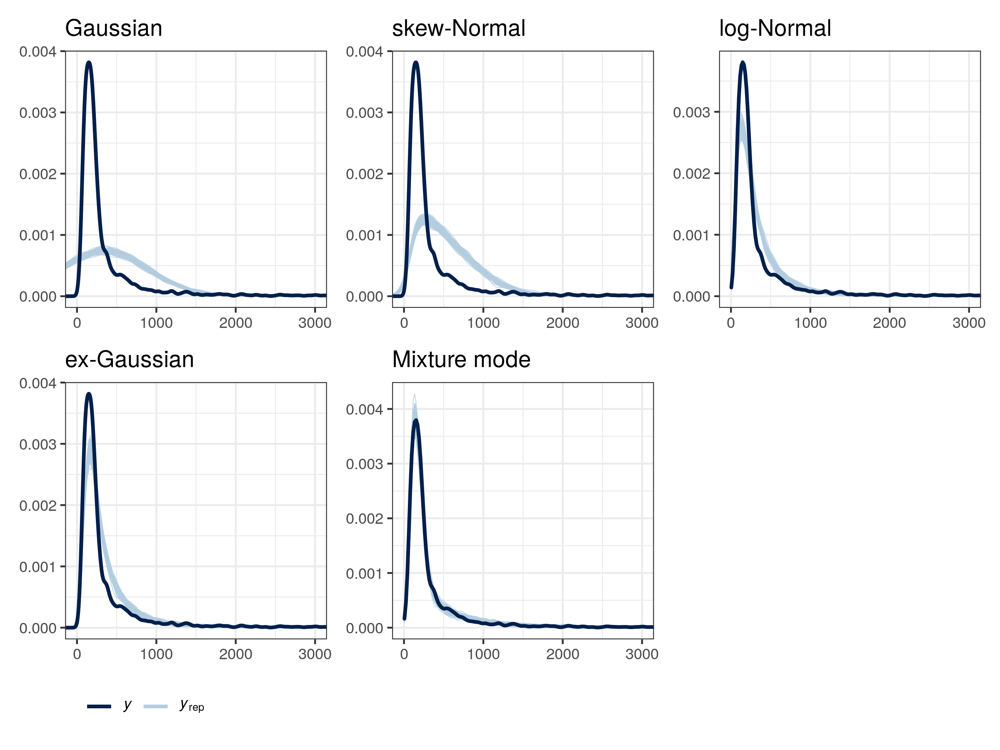

```{r setup, include=FALSE}
library(citr)
library(tidyverse)
library(magrittr)
library(lme4)
library(brms)
library(ggthemes)
library(kableExtra)
library(knitr)
library(readxl)
library(extrafont)
library(broom)
library(tidybayes)
library(janitor)
library(patchwork)
library(mixtools)
source("../scripts/functions.R")
options("kableExtra.html.bsTable" = T)
knitr::opts_chunk$set(echo = FALSE,
                      comment=NA, 
                      warning = FALSE,
                      message =FALSE)
theme_set(theme_few(base_size = 13))
brms_sim <- readRDS("../stanout/brms_sim_sample_prior.rda")
```


## Outline

>- Last session
>- Evaluating the posterior 
>- What are priors?
>- Models of keystroke data
>- Model comparisons
>- Mixture model evaluation
>- Summary and recommended reading
>- Bonus: Bayes factor


# Last session

## Fit models on simulated data

<div style="float: left;width: 75%; height:50%">

```{r, eval = T, echo = T}
data <- jens_data_machine(intercept = 300, slope = 15)
```

```{r}
fit_brm <- readRDS(file = "../stanout/brms_sim.rda")
```

```{r, eval = F, echo = T}
fit_brm <- brm(y ~ 1 + condition + (1|participant_id), data = data)
```

```{r, eval = F, echo = T}
fixef(fit_brm)
```

```{r, eval = T, echo = F}
fixef(fit_brm) %>% round(2)
```


## Model convergence

```{r eval = T, echo = T, fig.height=3.5}
plot(fit_brm, pars = c("b_Intercept", "b_conditionb"))
```


## Model convergence

$\hat{R}$ convergence statistic; should be $<1.1$ [@gelman1992]

```{r eval = T, echo = T}
rhat(fit_brm, pars = c("b_Intercept", "b_conditionb")) %>% round(3)
```

## Posterior predictive checks

Compare observed data $y$ and model predictions $y_{rep}$

```{r eval=T, echo = T, fig.height=3.5}
pp_check(fit_brm, nsamples = 100)
```


# Evaluating the posterior | see e.g. @nicenboim2016statistical for a tutorial


## Evaluating the posterior effect $\beta$

>- Bayesian inference is based on the **posterior**: the result of combining data, probability model, and prior information.
>- Estimating true parameter value $\beta$ (slope; difference between conditions).


```{r echo = T}
beta <- posterior_samples(fit_brm, pars = "b_conditionb") %>% pull()
```

```{r echo = T}
length(beta) # 4 chains with 2000 iterations / 2 (for warmup)
```

```{r echo = T}
beta[1:5]
```


## Evaluating the posterior effect $\beta$


<div style="float: right;width: 55%">

```{r fig.height=4.5, fig.width=5.5}
ggplot(data = NULL, aes(x = beta)) +
  geom_histogram(alpha = .55) +
  labs(x = bquote("Estimated effect"~hat(beta))) +
  scale_x_continuous(breaks = seq(-20,60,10))
```

</div>

## Evaluating the posterior effect $\beta$


<div style="float: left;width: 45%">

>- Posterior mean $\hat\beta$

```{r echo = T}
mean(beta)
```

</div>

<div style="float: right;width: 55%">

```{r fig.height=4.5, fig.width=5.5}
ggplot(data = NULL, aes(x = beta)) +
  geom_histogram(alpha = .55) +
  labs(x = bquote("Estimated effect"~hat(beta))) +
  geom_vline(xintercept = mean(beta), color = "darkred") +
  scale_x_continuous(breaks = seq(-20,60,10))
```
</div>


## Evaluating the posterior effect $\beta$


<div style="float: left;width: 45%">

>- 95% probability interval 

```{r echo = T}
quantile(beta, probs = c(0.025, 0.975))
```


</div>

<div style="float: right;width: 55%">

```{r fig.height=4.5, fig.width=5.5}
ggplot(data = NULL, aes(x = beta)) +
  geom_histogram(alpha = .55) +
  labs(x = bquote("Estimated effect"~hat(beta))) +
  geom_errorbarh(aes(y = 65, xmin = quantile(beta, probs = c(0.025))
, xmax =  quantile(beta, probs = c(0.975))), color = "darkred", size = 1.5, ) +
  annotate("text", x = 15, y = 90, label = "95% PI", colour = "darkred") +
  scale_x_continuous(breaks = seq(-20,60,10))
```
</div>


## Evaluating the posterior effect $\beta$


<div style="float: left;width: 45%">

>- Probability that slope $\hat\beta$ is negative: $P(\hat{\beta}<0)$

```{r echo = T}
mean(beta < 0)
```

>- More in the exercises: `parameter_evaluation.R`
>- Formal hypothesis test: `bayes_factors.html` slides (on github)


</div>

<div style="float: right;width: 55%">

```{r fig.height=4.5, fig.width=5.5}
beta2 <- beta[beta < 0]
ggplot(data = NULL, aes(x = beta, fill = beta > -1)) +
  geom_histogram(alpha = .55, position = "identity", show.legend = F) +
  scale_fill_manual(values = c("darkred", "grey")) +
  geom_vline(xintercept = 0, colour = "grey20", linetype = "dotted") +
  labs(x = bquote("Estimated effect"~hat(beta))) +
  scale_x_continuous(breaks = seq(-20,60,10))
```
</div>


# What are priors? | chapter 7 in @lee2014bayesian


## Priors

>- Prior knowledge about plausible parameter values.
>- This knowledge is expressed as probability distributions (e.g. normal distributions).
>- Small data will not easily overcome our priors but large data will (automatic Ockham's razor).
>- By default, each parameter value is equally possible (flat priors).
>- Even **weakly informative** priors are helpful for estimating parameter values.
>- Very specific priors can influence the posterior.


## Priors: intercept

>- Intercepts are some form of average.
>- Can keystroke intervals range between -$\infty$ and $\infty$? 
>- How long is the average pause before a sentence?
>- Plausible probability distribution for pre-sentence pauses:


## Priors: intercept

>- Intercepts are some form of average.
>- Can keystroke intervals range between -$\infty$ and $\infty$? 
>- How long is the average pause before a sentence?
>- Plausible probability distribution for pre-sentence pauses:


$$
\text{pre-sentence pause} \sim N(1000 \text{ msecs}, 500\text{ msecs})
$$


## Priors: slope


>- We often don't know what the effect could be.
>- However, we have an intuition about what's plausible and what isn't.
>- If we are not sure, we can use a mean of 0 msecs.


## Priors: slope

>- We often don't know what the effect could be.
>- However, we have an intuition about what's plausible and what isn't.
>- If we are not sure, we can use a mean of 0 msecs.


$$
\text{slope} \sim N(0 \text{ msecs}, 250\text{ msecs})
$$


## Priors

> Check defaults used earlier using `prior_summary()``:

\

```{r echo = T, eval = F}
fit_brm <- readRDS(file = "../stanout/brms_sim.rda")
prior_summary(fit_brm)
```

```{r echo = F, eval = T}
fit_brm <- readRDS(file = "../stanout/brms_sim.rda")
prior <- prior_summary(fit_brm) # %>% as_data_frame() %>% select(-source)
sd_prior <- prior %>% filter(class == "sd" & group == "") %>% pull(prior)
prior %>% as_tibble() %>%
  mutate(prior = ifelse(class == "b", "(flat)", prior),
         prior = ifelse(class == "sd", sd_prior, prior)) %>%
  select(prior:group) %>% kable() %>%
  kable_styling("striped", full_width = F) %>%
  column_spec(1, width = "20em") %>%
  column_spec(2:4, width = "10em") 
```


## Student *t*-distribution

<div style="float: left;width: 35%;">

>- Symmetric continuous distribution with fat tails assigning more probability to extreme values.
>- Allows for extreme values.
>- $\nu$ parameter controls the degrees of freedom
>- $\nu = 1$ is a flat 
>- When $\nu \rightarrow \infty$ distribution becomes Gaussian.

</div>


<div style="float: right;width: 60%;">

```{r fig.width=6}
library(LaplacesDemon)

x <- seq(-10, 10, by = 0.1)

tibble("t0" = dnorm(x, mean=0, sd=1),
       "t1" = dst(x, mu=0, sigma=1, nu = 1),
       "t2" = dst(x, mu=0, sigma=1, nu = 5),
#       "t3" = dst(x, mu=0, sigma=2, nu = 5),
       x = x) %>%
  pivot_longer(-x) %>%
  ggplot(aes(x = x, y = value, colour = name)) +
  geom_line() +
  scale_x_continuous(limits = c(-7, 7)) +
  scale_color_colorblind("Parameter values",
                         breaks = paste0("t",0:2), 
                         labels = c(bquote(mu==0*","~sigma==1),
                                    bquote(mu==0*","~sigma==1*","~nu==1),
                                    bquote(mu==0*","~sigma==1*","~nu==5)
                                    #bquote(mu==0*","~sigma==2*","~nu==5)
                                    )) +
  labs(x = "x", y = "density") +
  theme(legend.justification = "top") 

```
</div>


## Prior specification: model


> Instead of 

\

```{r echo = T, eval = F}
fit <- brm(outcome ~ predictor + (1|participant), data = data)
```

\

> do ...

\


```{r echo = T, eval = F}
model <- bf(outcome ~ predictor + (1|participant))

fit <- brm(model, data = data)
```


## Prior specification: prior


```{r echo = T, eval = F}
model <- bf(outcome ~ predictor + (1|participant))

get_prior(model, data = data)

prior <- set_prior("normal(1000, 500)", class = "Intercept", lb = 0, ub = 100000) +
         set_prior("normal(0, 100)", class = "b") # for slope(s)

fit <- brm(model, data = data, prior = prior)
```

>- Adding priors to last session's model `brms_sim_with_prior.R`.
>- Replace the `---`s according to the comments in the script.


```{r echo=F}
data <- read_csv("../data/sentence_transitions.csv") %>% 
  select(SubNo, Lang, transition_type, IKI) %>%
  filter(IKI > 50, IKI < 5000)
```


# Models of keystroke data

## Models of keystroke data


\

>"Models are devices that connect theories to data.  A model is an instantiation of a theory [...]" [@rouder2016interplay p. 2] 

\

- Models describe how we understand reality.
- Model allows us to describe reality qualitatively (with their parameters) and quantitatively (parameter value estimates): 
- e.g. mean keystroke intervals (to the extent that means are a good summary of keystroke intervals)
- At minimum, distribution families (probability models) depend on data type.
- This isn't all; there are many distribution families for modeling continuous data.   


## Distribution families (some important ones)

>- **Gaussian**: data come from normal distribution (last session)

```{r eval=F, echo=T}
model <- bf(outcome ~ predictor + (1|participant), family = gaussian())
```


## Distribution families (some important ones)

>- **Gaussian**: data come from normal distribution (last session)
>- **Bernoulli**: binomial outcomes (yes / no; correct / incorrect)

```{r eval=F, echo=T}
model <- bf(outcome ~ predictor + (1|participant), family = bernoulli())
```

## Distribution families (some important ones)

>- **Gaussian**: data come from normal distribution (last session)
>- **Bernoulli**: binomial outcomes (yes / no; correct / incorrect)
>- **Poisson**: count data (number of words / mistakes)


```{r eval=F, echo=T}
model <- bf(outcome ~ predictor + (1|participant), family = poisson())
```


## Distribution families (some important ones)

>- **Gaussian**: data come from normal distribution (last session)
>- **Bernoulli**: binomial outcomes (yes / no; correct / incorrect)
>- **Poisson**: count data (number of words / mistakes)
>- Families for ordinal (ordered) data [@burkner2019ordinal] (Likert scales)


```{r eval=F, echo=T}
model <- bf(outcome ~ predictor + (1|participant), family = cumulative())# or acat, sratio
```


## Models of keystroke data

<div style="float: left;width: 45%;">

>- Keystroke data from 39 ppts writing texts.
>- Sentence transitions (keystroke interval between sentences).
>- Keystroke interval data are heavily skewed.
>- Skew is normal and contains important information: additional cognitive demands.


</div>


<div style="float: right;width: 55%;">

```{r fig.width=5.5}
data %>% ggplot(aes(x = IKI)) + geom_histogram() + labs(x = "IKI [in msecs]") 
```
</div>


## Models of keystroke data {.columns-2}


>- A good model of keystroke data should be able to capture the positive skew.
>- Many probability models that deal with skew explicitly [see @matzke2009psychological].
>- Describing the data generating process in different ways: entail different ways of thinking about what skew means.

\

>- Homework models:
>- Modelling interkeystroke intervals (IKI) after accounting for random variability across participants:
>- `IKI ~ 1 + (1|participant)`
>- 5 models of keystroke data: Gaussian, log-Normal, skewed-Normal, ex-Gaussian, mixture of log-Normals


## Gaussian 

$$y \sim N(\mu, \sigma^2)$$

>- Values are symmetrically distributed with a mean $\mu$ and standard deviation $\sigma^2$.
>- $\mu$: mean keystroke intervals
>- $\sigma^2$: standard deviation; symmetrical variability around $\mu$
>- The underlying process that generates data has an equal chance of being slower or faster than the mean.

## Gaussian 

```{r eval=F, echo=T}
model <- bf(IKI ~ 1 + (1|SubNo), 
            family = gaussian())
gaussian <- brm(mode, data = data)
```


```{r}
gaussian <- readRDS("../stanout/gaussian_sentence.rda")
```

>- Model estimate

```{r echo = T}
round(fixef(gaussian)[,-2])
```

>- Observed mean

```{r echo = T}
round(mean(data$IKI))
```


## Gaussian


```{r }
data$log_iki <- log(data$IKI)
ggplot(data, aes(x = IKI)) +
  geom_histogram() +
  labs(x = "IKI [in msecs]") +
  geom_vline(xintercept = 380, colour = "red") +
  annotate("text", x = 750, y = 800, label = "Estimated\nmean")
```


## Log-Normal 

<div style="float: left;width: 50%;">

>- Often used to address positive skew; e.g. response times [@baa08book]
>- De-emphasize large values over small values: Difference of 40 msecs can be huge for fast typing but negligible for pauses around 10 secs. 
>- Log is only defined if $y \in [0, \infty]$

</div>

<div style="float: right;width: 50%;">

```{r fig.height=4, fig.width=5}
data$log_iki <- log(data$IKI)
iki <- ggplot(data, aes(x = IKI)) +
  geom_histogram() +
  labs(x = "IKIs [in msecs]")
log_iki <- ggplot(data, aes(x = log_iki)) +
  geom_histogram() +
  labs(x = "IKIs [in log(msecs)]")
iki / log_iki
```
</div>


## Log-Normal 

```{r}
lognormal <- readRDS("../stanout/lognormal_sentence.rda")
```


```{r eval=F, echo=T}
model <- bf(IKI ~ 1 + (1|SubNo), family = lognormal())
lognormal <- brm(mode, data = data)
```

>- Model estimates

```{r echo = T}
round(exp(fixef(lognormal)[,-2]))
```

>- Observed mean

```{r echo = T}
round(mean(data$IKI))
```


## Log-Normal

```{r}
ggplot(data, aes(x = IKI)) +
  geom_histogram() +
  labs(x = "IKIs [in msecs]") +
  geom_vline(xintercept = 232.69, colour = "red") +
  annotate("text", x = 650, y = 800, label = "Estimated\nmean")
```


## Ex-Gaussian

<div style="float: left;width: 55%;">
>- Response is caused by a mix of two processes:
>  1. Gaussian distribution
>  2. Exponential distribution
>- For keystroke data [@chukharev2014pauses]
  
- $\mu$ of Gaussian
- $\sigma^2$ of Gaussian
- $\tau$ of Exponential: 
    - decay rate
    - tail of long keystroke intervals 
    - larger $\tau$ means more tail dominance over Gaussian
</div>

<div style="float: right;width: 45%;">

</div>


```{r}
exGausDist <- function(nObs = 10000, mu = 300, sd = 30, tau = 200) {
  round(rnorm(nObs, mu, sd) + rexp(nObs, 1 / tau))
}

exgaus <- tibble("t1" = exGausDist(tau = 0),
       "t2" = exGausDist(tau = 100),
       "t3" = exGausDist(tau = 250),
       "t4" = exGausDist(tau = 500)) %>%
  pivot_longer(everything())
```

## Ex-Gaussian

```{r}
exgaus %>% filter(name == "t1") %>%
  ggplot(aes(x = value, colour = name)) +
  geom_density(colour = "white") +
  scale_x_continuous(limits = c(0, 1500)) +
  scale_color_colorblind(breaks = paste0("t",1:4), labels = c(bquote(tau==50),bquote(tau==100),bquote(tau==250),bquote(tau==500))) +
  labs(colour = "Exponential\nparameter\nvalue", subtitle = bquote("Gaussian parameter values:"~mu==300*","~sigma^2==30), x = "x") +
  theme(legend.justification = "top")
```

## Ex-Gaussian

```{r}
exgaus %>% filter(name == "t1") %>%
  ggplot(aes(x = value, colour = name)) +
  geom_density() +
  scale_x_continuous(limits = c(0, 1500)) +
  scale_color_colorblind(breaks = paste0("t",1:4), labels = c(bquote(tau==0),bquote(tau==100),bquote(tau==250),bquote(tau==500))) +
  labs(colour = "Exponential\nparameter\nvalue", subtitle = bquote("Gaussian parameter values:"~mu==300*","~sigma^2==30), x = "x") +
  theme(legend.justification = "top")
```

## Ex-Gaussian

```{r}
exgaus %>% filter(name %in% paste0("t", 1:2)) %>%
  ggplot(aes(x = value, colour = name)) +
  geom_density() +
  scale_x_continuous(limits = c(0, 1500)) +
  scale_color_colorblind(breaks = paste0("t",1:4), labels = c(bquote(tau==0),bquote(tau==100),bquote(tau==250),bquote(tau==500))) +
  labs(colour = "Exponential\nparameter\nvalue", subtitle = bquote("Gaussian parameter values:"~mu==300*","~sigma^2==30), x = "x") +
  theme(legend.justification = "top")
```

## Ex-Gaussian

```{r}
exgaus %>% filter(name %in% paste0("t", 1:3)) %>%
  ggplot(aes(x = value, colour = name)) +
  geom_density() +
  scale_x_continuous(limits = c(0, 1500)) +
  scale_color_colorblind(breaks = paste0("t",1:4), labels = c(bquote(tau==0),bquote(tau==100),bquote(tau==250),bquote(tau==500))) +
  labs(colour = "Exponential\nparameter\nvalue", subtitle = bquote("Gaussian parameter values:"~mu==300*","~sigma^2==30), x = "x") +
  theme(legend.justification = "top")
```

## Ex-Gaussian

```{r}
exgaus %>% filter(name %in% paste0("t", 1:4)) %>%
  ggplot(aes(x = value, colour = name)) +
  geom_density() +
  scale_x_continuous(limits = c(0, 1500)) +
  scale_color_colorblind(breaks = paste0("t",1:4), labels = c(bquote(tau==0),bquote(tau==100),bquote(tau==250),bquote(tau==500))) +
  labs(colour = "Exponential\nparameter\nvalue", subtitle = bquote("Gaussian parameter values:"~mu==300*","~sigma^2==30), x = "x") +
  theme(legend.justification = "top")
```


## Ex-Gaussian

```{r echo = T, eval = F}
model <- bf(IKI ~ 1 + (1 | SubNo),  
            beta ~ 1 + (1 | SubNo), # decay parameter (exponential component)
            family = exgaussian())

prior <- set_prior("normal(250, 20)", class = "Intercept") +
         set_prior("normal(6, 2)", class = "Intercept", dpar = "beta") # decay rate in log msecs
```


## Skew-Normal

>- Non-symmetric Gaussian with extra skew-parameter $\alpha$: 
>- positive skew $\alpha > 0$
>- negative skew $\alpha < 0$; 
  
  
```{r fig.height=3}
library(PearsonDS)

skewrnorm <- function(x = seq(-10, 10, .1), mean = 0, variance = 5, skewness = 0, kurtosis = 3){
  moments <- c(mean = mean, variance = variance, skewness = skewness, kurtosis = kurtosis)
  x <- dpearson(x, moments = moments)
  return(x)
}

tibble("t1" = skewrnorm(skewness = 0),
       "t2" = skewrnorm(skewness = .8),
       "t3" = skewrnorm(skewness = -.8),
       x = seq(-10, 10, .1)) %>%
  pivot_longer(-x) %>%
  group_by(name) %>%
  mutate(mean = mean(value),
         median = mean(value)) %>%
  ggplot(aes(x = x, y = value, colour = name)) +
  geom_line() +
  scale_x_continuous(limits = c(-10, 10)) +
  scale_color_colorblind(breaks = paste0("t",1:3), labels = c("No skew", "Positive skew", "Negative skew")) +
  labs(colour = "", subtitle = bquote("Gaussian parameter values:"~mu==0*","~sigma^2==5), x = "x", y = "density") +
  theme(legend.justification = "top") +
  geom_vline(xintercept = 0, linetype = "dotted") 


```


## Mixture model

$$
y \sim (1-\theta) \cdot N(\mu_1, \sigma^2_1) + \theta \cdot N(\mu_2, \sigma^2_2) 
$$

>- Finite mixture model with two distributions (mixture components)
>- Keystroke intervals come from a mix of two independent processes [@roeser2021]:
>- Short keystroke intervals: normal execution
>- Long keystroke intervals: cognitively demanding

- Parameters:
  - $\mu_1, \sigma^2_1$: mean and sd of one distribution
  - $\mu_2, \sigma^2_2$: mean and sd of other distribution
  - $\theta$: mixing proportion of distributions

- Mixing proportion $\theta$ is probability of data coming from the second distribution.


```{r}
set.seed(100)
MixModDist <- function(n = 10000, mu = c(350, 750), sigma = c(50, 50), lambda = c(.5, .5)) {
  rnormmix(n = n, lambda = lambda, mu = mu, sigma = sigma)}

mixmod <- tibble("t1" = MixModDist(),
       "t2" = MixModDist(lambda = c(.6,.4)),
       "t3" = MixModDist(lambda = c(.75,.25)),
       "t4" = MixModDist(lambda = c(.95,.05))) %>%
  pivot_longer(everything())

```


## Mixture model

```{r}
mixmod %>% filter(name %in% paste0("t",1)) %>%
  ggplot(aes(x = value, colour = name)) +
 geom_density(colour = "white") +
 scale_x_continuous(limits = c(0, 1500)) +
 scale_color_colorblind(breaks = paste0("t",1:4), labels = c(bquote(theta[2]==.5),bquote(theta[2]==.4),bquote(theta[2]==.25),bquote(theta[2]==.05))) +
  labs(colour = "Mixing proportion\nparameter\nvalue", subtitle = bquote("Gaussian parameter values:"~mu[1]==350*","~mu[2]==750*","~sigma[1]^2==50*","~sigma[2]^2==50), x = "x") +
  theme(legend.justification = "top")
```

## Mixture model

```{r}
mixmod %>% filter(name %in% paste0("t",1)) %>%
  ggplot(aes(x = value, colour = name)) +
 geom_density() +
 scale_x_continuous(limits = c(0, 1500)) +
 scale_color_colorblind(breaks = paste0("t",1:4), labels = c(bquote(theta[2]==.5),bquote(theta[2]==.4),bquote(theta[2]==.25),bquote(theta[2]==.05))) +
  labs(colour = "Mixing proportion\nparameter\nvalue", subtitle = bquote("Gaussian parameter values:"~mu[1]==350*","~mu[2]==750*","~sigma[1]^2==50*","~sigma[2]^2==50), x = "x") +
  theme(legend.justification = "top")
```

## Mixture model

```{r}
mixmod %>% filter(name %in% paste0("t",1:2)) %>%
  ggplot(aes(x = value, colour = name)) +
 geom_density() +
 scale_x_continuous(limits = c(0, 1500)) +
 scale_color_colorblind(breaks = paste0("t",1:4), labels = c(bquote(theta[2]==.5),bquote(theta[2]==.4),bquote(theta[2]==.25),bquote(theta[2]==.05))) +
  labs(colour = "Mixing proportion\nparameter\nvalue", subtitle = bquote("Gaussian parameter values:"~mu[1]==350*","~mu[2]==750*","~sigma[1]^2==50*","~sigma[2]^2==50), x = "x") +
  theme(legend.justification = "top")
```


## Mixture model

```{r}
mixmod %>% filter(name %in% paste0("t",1:3)) %>%
  ggplot(aes(x = value, colour = name)) +
 geom_density() +
 scale_x_continuous(limits = c(0, 1500)) +
 scale_color_colorblind(breaks = paste0("t",1:4), labels = c(bquote(theta[2]==.5),bquote(theta[2]==.4),bquote(theta[2]==.25),bquote(theta[2]==.05))) +
  labs(colour = "Mixing proportion\nparameter\nvalue", subtitle = bquote("Gaussian parameter values:"~mu[1]==350*","~mu[2]==750*","~sigma[1]^2==50*","~sigma[2]^2==50), x = "x") +
  theme(legend.justification = "top")
```


## Mixture model


```{r echo = T, eval = F}
# Specify mixture model
mixture_of_lognormals <- mixture(lognormal(), lognormal())

# Specify model 
model <- bf(IKI ~ 1 + (1 | SubNo),
            theta2 ~ 1 + (1 | SubNo),
            family = mixture_of_lognormals)

# Setup priors
prior <-  set_prior("normal(4, 1)", class = "Intercept", dpar = "mu1") +
          set_prior("normal(6, 1)", class = "Intercept", dpar = "mu2") +
          set_prior("beta(2, 2)", class = "Intercept", dpar = "theta2") 
```


## Difference between models


Model             Extreme values
---------------   ------------------------------------------
Gaussian          Equally likely in both tails
log-Normal        Re-scale distance between adjacent values
skew-Normal       Extreme values are more likely in one tail
ex-Gaussian       Exponential component for right tail
Mixture model     Another distribution with mixing parameter
    

# Model comparisons | chapter 11 in @gelman2020regression; chapter 6 in @mcelreath2016statistical


## Exercise: model comparison (1)

>- What is a good model for keystroke intervals between sentences?
>- How well does the model predict the data?
>- Draw simulations from each model and compare them to the actual data.
>- Complete `visualise_model_fit.R`.
>- The script assumes that you have stored the posterior of homework models.


## Model predictions

<div style="float: left;width: 65%;">

{width="94%"}

</div>

<div style="float: right;width: 30%;">

>- Observed data $y$ compared to 100 simulations per model $y_{rep}$.
>- Which model does the worst job; which does the best?
>- But how well do models perform beyond the sample they were fitted on?

</div>


## Overfitting

>- Complex models explain more variance but may make over optimistic predictions [@gelman2020regression].
>- Example: brain size and body mass for seven primate species [from @mcelreath2016statistical].


```{r fig.height=3.5, fig.width=8}
d <- tibble(species = c("afarensis", "africanus", "habilis", "boisei", "rudolfensis", "ergaster", "sapiens"), 
         brain   = c(438, 452, 612, 521, 752, 871, 1350), 
         mass    = c(37.0, 35.5, 34.5, 41.5, 55.5, 61.0, 53.5))

fit_lm <- function(model, formula){
  model <- lm(data = d, formula = formula)
}

fits <- tibble(model   = str_c("b6.", 1:6),
         formula = c("brain ~ mass", 
                     "brain ~ mass + I(mass^2)", 
                     "brain ~ mass + I(mass^2) + I(mass^3)", 
                     "brain ~ mass + I(mass^2) + I(mass^3) + I(mass^4)", 
                     "brain ~ mass + I(mass^2) + I(mass^3) + I(mass^4) + I(mass^5)", 
                     "brain ~ mass + I(mass^2) + I(mass^3) + I(mass^4) + I(mass^5) + I(mass^6)")) %>% 
  mutate(fit     = map2(model, formula, fit_lm)) %>% 
  mutate(tidy    = map(fit, tidy),
         glance  = map(fit, glance))


fits <- fits %>% 
  mutate(r2      = glance %>% map_dbl("r.squared")) %>% 
  mutate(r2_text = round(r2, digits = 2) %>% as.character() %>% str_replace(., "0.", "."))

p <-  ggplot(d, aes(x = mass, y = brain)) +
  geom_point(size = 2.5, shape = 21) +
  scale_x_continuous(limits = c(33, 62), expand = c(0, 0)) +
  coord_cartesian(ylim = c(300, 1500)) +
  theme(plot.margin = margin(0,0,0,0),
        axis.title = element_blank(),
        plot.title = element_text(size = 12),
        plot.subtitle = element_text(size = 10))
# linear
p1 <-  p + stat_smooth(method = "lm", fullrange = TRUE, level = .89,
              size = 1/2, alpha = 1/3, colour = "darkred",
              formula = y ~ x) +
  labs(title = "Linear model", subtitle = expression(paste(italic(R)^2, " = .49")))
  
# cubic
p3 <- p + stat_smooth(method = "lm", fullrange = TRUE, level = .89,
              size = 1/2, alpha = 1/3,  colour = "darkred",
              formula = y ~ poly(x, 3)) +
  labs(title = "3rd-order polynomial", subtitle = expression(paste(italic(R)^2, " = .68")))

# sixth-order polynomial
p6 <-  p + geom_hline(yintercept = 0, linetype = 2) + 
  stat_smooth(method = "lm", fullrange = TRUE, level = .89,
              size = 1/2, alpha = 1/3,  colour = "darkred",
              formula = y ~ poly(x, 6)) +
  coord_cartesian(ylim = c(-300, 1500)) +
  labs(title = "6th-order polynomial", subtitle = expression(paste(italic(R)^2, " = 1")))

plot <- p1 + p3 + p6

gt <- patchwork::patchworkGrob(plot)
gridExtra::grid.arrange(gt, left = "Brain volume (cc)", bottom = "Body mass (kg)")
```


## Leave-One-Out (LOO) cross validation {.columns-2}

>- Cross validation bypasses the overfitting problem.
>- Test how well the model predicts data *out-of-sample*.
>- LOO: model on $N-1$ data can predict the remaining data point.

\

>- `loo()` uses a probability calculation to approximate LOO information criterion (i.e. Pareto smoothed importance sampling) [@vehtari2015pareto; @vehtari2017practical].
>- Adding up prediction results gives **expected log-predictive density** ($elpd$).
>- Ability of the model to predict new data (i.e. predictive performance).


## Leave-One-Out (LOO) cross validation {.columns-2}


```{r echo = T}
loo(gaussian)
```

\

>- Approximation involved in `loo()` uses the log posterior predictive densities: likelihood of each data point given the distribution parameter estimates.
>- These values don't have an interpretation on their own but need to be considered in comparison to other models.


## Leave-One-Out (LOO) cross validation {.columns-2}


```{r echo = T}
loo(gaussian)
```

\

>- `elpd_loo` (expected log predictive density): sum of means of predictive performance
>- `p_loo`: sum of variances
>- `looic`: $-2 \cdot ($`elpd_loo`$-$`p_loo`$)$ (for deviance scale)


## Exercise: model comparison (2)

>- Script `model_comparison.R`
>- Which model has the highest elpd score (i.e. highest predictive performance)?
>- This script, again, assumes that you have stored the posterior of the 5 homework models.


```{r}
mc <- readRDS("../stanout/model_comparison.rda")
```


## Model comparison

```{r}
mc$diff %>%
  as.data.frame() %>%
  rownames_to_column("model") %>% 
  select(model:se_elpd_loo) %>%
  mutate(across(where(is.numeric), round, 1)) %>%
  kable() %>%
  kable_styling("striped", full_width = F) %>%
  column_spec(1:5, width = "10em") %>%
  add_footnote("`elpd_loo` is reported as $\\\\widehat{elpd}$ and the difference as $\\\\Delta\\\\widehat{elpd}$.")

```


# Mixture-model evaluation | see @roeser2021

```{r}
mixturemodel <- readRDS("../stanout/mixture_model_sentence.rda")
```


## Mixture-model parameters (population level)

```{r echo = T}
posterior_summary(mixturemodel, pars = "b_theta2_Intercept")[,-2] %>% round(2)
```

```{r echo = T}
coefs <- c("b_mu1_Intercept", "b_mu2_Intercept")
posterior_summary(mixturemodel, pars = coefs)[,-2] %>% exp() %>% round()
```

```{r echo = T}
posterior_summary(mixturemodel, pars = c("sigma1", "sigma2"), fixed = T)[,-2] %>% round(2)
```


## Mixture-model parameters (ppt level)

```{r fig.width=9}
ppt_vars <- posterior_summary(mixturemodel, pars = "r_SubNo__theta2") %>%
  as.data.frame() %>%
  rownames_to_column("SubNo") %>%
  mutate(SubNo = str_match(SubNo, "S-\\s*(.*?)\\s*[,]")[,1],
         SubNo = gsub(",", "", SubNo)) %>%
  as_tibble()

# Plot the by-ppt values
# Values above 0: ppt shows more long values than average
# Values below 0: ppt shows less long values than average
ggplot(ppt_vars, aes(y = Estimate, ymin = `Q2.5`, ymax = `Q97.5`, 
                     x = reorder(SubNo, Estimate))) +
  geom_hline(yintercept = 0, linetype = "dotted", colour = "grey") +
  geom_pointrange() + theme_bw() +
  labs(y = "Difference from population-level\nmixing proportion in SDs",
       x = "Participant id") +
  theme(axis.text.x = element_text(angle = 45, hjust = 1, size = 10))
```

## Mixture-model evaluation 

>- Summarise the parameter estimates of the mixture model.
>- Complete the `---`s in `mixturemodel_posterior.R` and run the script.
>- Try to make sense of the parameter estimates.


# The end

## Summary

>- A basic `brms` isn't more complicated than `lmer`.
>- Priors require some thinking.
>- Bayesian models allow straight forward interpretation of parameter values without an arbitrary threshold for significance.
>- `brms` allows us to fit various models of keystroke intervals. 
>- Mixture models showed better fit for sentence transitions.


## Recommended reading

>- Bürkner's tutorials [@brms1; @brms2; @burkner2019ordinal; @burkner2019bayesian]
>- Vasishth's tutorials [@sorensen2016bayesian; @nicenboim2016statistical; @vasishth2016statistical]
>- Book-length intros: @gelman2020regression, @mcelreath2016statistical, @kruschke2014doing, @lambert2018student, @lee2014bayesian


## References

<style>
slides > slide { overflow: scroll; }
slides > slide:not(.nobackground):after {
  content: '';
}
</style>